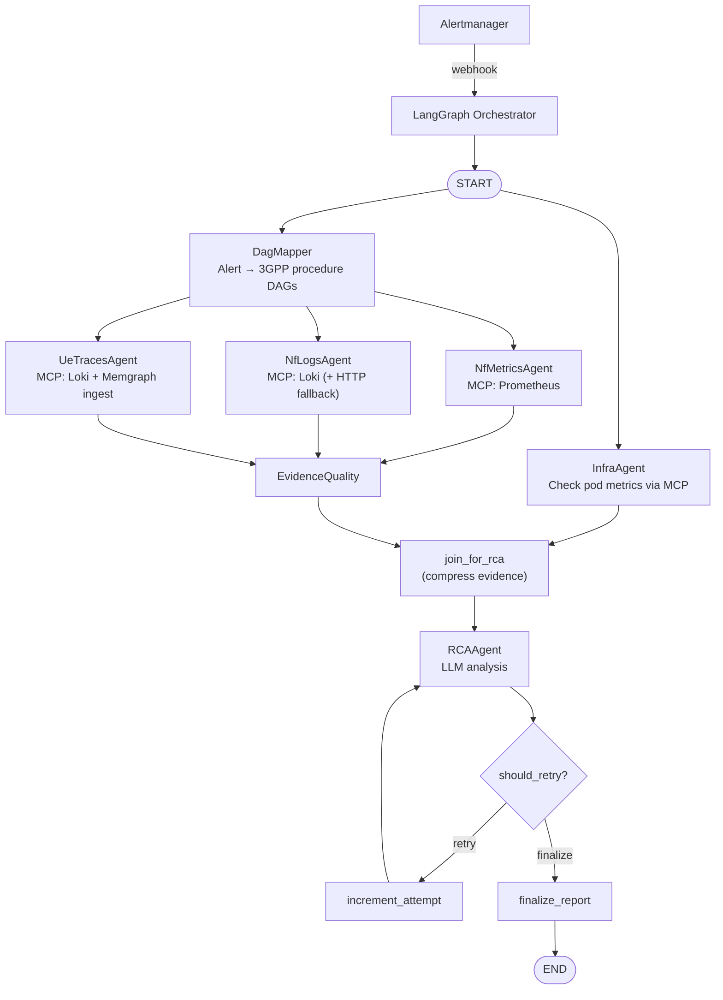

# 5G TriageAgent — Developer Guide

## 1. Overview

5G TriageAgent is a multi-agent LangGraph orchestration system for real-time root cause analysis
of 5G core network failures. When Prometheus Alertmanager fires an alert (e.g.
`RegistrationFailures`), the system runs a directed pipeline of specialized agents to localise the
failure across three layers: **infrastructure** (pod restarts, OOM kills), **network function**
(NF metrics and logs), and **3GPP procedure** (UE trace deviations against reference DAGs).

The pipeline queries five data sources — Kubernetes pod metrics, NF-level Prometheus metrics,
Loki logs, Memgraph reference DAGs, and live UE signalling traces — then sends compressed evidence
to an LLM that produces a structured root cause report: `root_nf`, `failure_mode`, `layer`,
`confidence` (0–1), and a timestamped `evidence_chain`.

All agents except RCAAgent are deterministic (rule-based or query-based). Only RCAAgent calls an LLM.

## 2. Prerequisites

| Requirement | Notes |
|-------------|-------|
| Python 3.11+ | |
| Docker / Kubernetes | For deployment; local dev uses `uvicorn` directly |
| Prometheus | Reachable at `PROMETHEUS_URL` (default: `http://kube-prom-kube-prometheus-prometheus.monitoring:9090`) |
| Loki | Reachable at `LOKI_URL` (default: `http://loki.monitoring:3100`) |
| Memgraph | Bolt port 7687; runs as a sidecar in production; standalone for local dev |
| `mgconsole` | CLI tool to load DAG Cypher files into Memgraph |
| LLM access | Set `LLM_PROVIDER` + `LLM_API_KEY` (cloud) or `LLM_BASE_URL` (local vLLM/Ollama) |
| LangSmith (optional) | Set `LANGCHAIN_TRACING_V2=true` + `LANGSMITH_API_KEY` for span tracing |

## 3. Quick Start

```bash
# 1. Install
git clone <repo>
cd 5g-triage-agent
pip install -e ".[dev]"

# 2. Start Memgraph (local dev — Docker)
docker run -d -p 7687:7687 memgraph/memgraph:latest

# 3. Load DAGs into Memgraph
mgconsole < dags/registration_general.cypher
mgconsole < dags/authentication_5g_aka.cypher
mgconsole < dags/pdu_session_establishment.cypher

# Verify DAGs loaded
mgconsole -host localhost -port 7687 <<< "MATCH (t:ReferenceTrace) RETURN t.name;"

# 4. Set environment variables (minimum for local dev)
export LLM_PROVIDER=openai
export LLM_API_KEY=sk-...
export PROMETHEUS_URL=http://localhost:9090   # or your cluster URL
export LOKI_URL=http://localhost:3100

# 5. Start the webhook server
uvicorn triage_agent.api.webhook:app --reload --port 8000

# 6. Send a test alert
curl -X POST http://localhost:8000/webhook \
  -H "Content-Type: application/json" \
  -d '{
    "status": "firing",
    "receiver": "triage-agent",
    "alerts": [{
      "status": "firing",
      "labels": {
        "alertname": "RegistrationFailures",
        "severity": "critical",
        "namespace": "5g-core",
        "nf": "amf"
      },
      "annotations": {"summary": "Registration failures detected"},
      "startsAt": "2026-02-15T10:00:00Z",
      "endsAt": "0001-01-01T00:00:00Z",
      "generatorURL": "",
      "fingerprint": "abc123"
    }]
  }'
# Response: {"incident_id": "abc-123", "status": "accepted", ...}

# 7. Poll for result
curl http://localhost:8000/incidents/<incident_id>
# {"status": "pending"} while running; {"status": "complete", "final_report": {...}} when done
```

## 4. System Architecture



### How the pipeline works

**Parallel start:** `InfraAgent` and `DagMapper` both start immediately from `START`. They are
independent — infra triage does not need to know which 3GPP procedures are involved.

**Evidence fan-out:** Once `DagMapper` writes `nf_union` (the list of NFs involved in the matched
procedures), LangGraph fans out to `NfMetricsAgent`, `NfLogsAgent`, and `UeTracesAgent` in
parallel. All three query different data sources for the same set of NFs over the same time window.

**Evidence convergence:** All three collection agents write to `EvidenceQuality`, which scores
the diversity of evidence collected (0.10–0.95 depending on which sources have data).

**`join_for_rca` barrier:** This node has two incoming edges — from `InfraAgent` and from
`EvidenceQuality`. LangGraph waits for **both** to complete before executing `join_for_rca`.
This guarantees that `infra_findings` and `infra_score` are in state before the LLM prompt is
built. `join_for_rca` compresses all evidence sections to fit within the LLM context budget,
writing the result to `state["compressed_evidence"]`.

**RCAAgent and retry loop:** RCAAgent reads `compressed_evidence` and calls the LLM. If confidence
is below the threshold (0.70 by default, 0.65 if evidence quality ≥ 0.80), `should_retry` routes
to `increment_attempt → rca_agent` for a second pass. Hard limit: `max_attempts=2`. After the
final attempt, `finalize_report` writes `state["final_report"]`.
