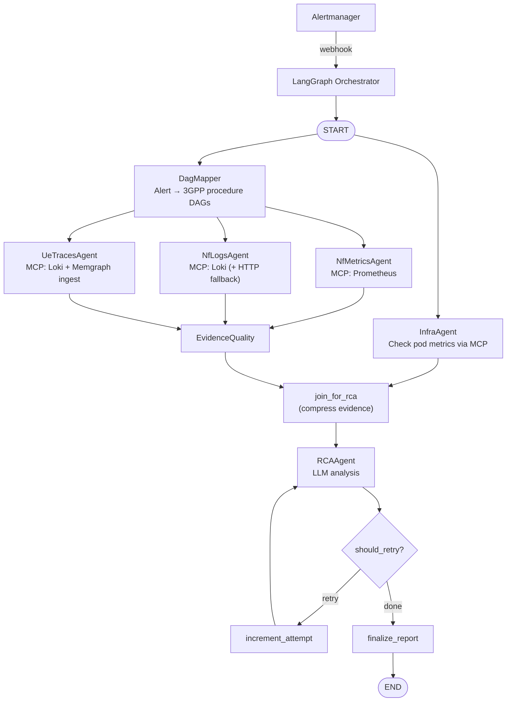

# Developer Documentation Implementation Plan

> **For Claude:** REQUIRED SUB-SKILL: Use superpowers:executing-plans to implement this plan task-by-task.

**Goal:** Write developer-focused documentation in `docs/` that lets a new engineer understand, run, contribute to, and debug the 5G TriageAgent system without reading source code first.

**Architecture:** Three output files: `docs/README.md` (hub with 11 sections), `docs/configuration-reference.md` (all ~75 config fields), `docs/agent-development.md` (agent code templates and patterns). The old PRD is backed up as `.archive.md` before being replaced.

**Tech Stack:** Markdown, Mermaid diagrams (already in `docs/workflow_diagram.mermaid`), cross-references between files.

---

## Context for the implementer

This is a **documentation-writing** task, not a code task. There is no test suite to run. The verification step for each task is: read back what you wrote and cross-check field names, function names, and file paths against the source files listed in each task. All source files are in `src/triage_agent/`.

Key source files you will reference repeatedly:
- `src/triage_agent/state.py` — all TriageState fields
- `src/triage_agent/config.py` — all config fields with their docstring comments
- `src/triage_agent/graph.py` — node registration and edge wiring
- `src/triage_agent/agents/` — one file per agent
- `src/triage_agent/api/webhook.py` — incident lifecycle
- `dags/registration_general.cypher` — example DAG Cypher structure
- `docs/workflow_diagram.mermaid` — existing pipeline diagram (reuse verbatim)

---

## Task 0: Back up old PRD

**Files:**
- Copy: `docs/triageagent_architecture_design2.md` → `docs/triageagent_architecture_design2.archive.md`

**Step 1: Copy the file**

```bash
cp docs/triageagent_architecture_design2.md docs/triageagent_architecture_design2.archive.md
```

**Step 2: Verify**

```bash
diff docs/triageagent_architecture_design2.md docs/triageagent_architecture_design2.archive.md
```
Expected: no output (identical files).

**Step 3: Commit**

```bash
git add docs/triageagent_architecture_design2.archive.md
git commit -m "docs: archive old PRD as .archive.md"
```

---

## Task 1: `docs/README.md` — Sections 1–3 (Overview, Prerequisites, Quick Start)

**Files:**
- Create: `docs/README.md`

**Step 1: Write sections 1–3**

Create `docs/README.md` with the following content. Write exactly this — do not paraphrase:

```markdown
# 5G TriageAgent — Developer Guide

## 1. Overview

5G TriageAgent is a multi-agent LangGraph orchestration system for real-time root cause analysis
of 5G core network failures. When Prometheus Alertmanager fires an alert (e.g.
`RegistrationFailures`), the system runs a directed pipeline of specialized agents to localise the
failure across three layers: **infrastructure** (pod restarts, OOM kills), **network function**
(NF metrics and logs), and **3GPP procedure** (UE trace deviations against reference DAGs).

The pipeline queries five data sources — Kubernetes pod metrics, NF-level Prometheus metrics,
Loki logs, Memgraph reference DAGs, and live UE signalling traces — then sends compressed evidence
to an LLM that produces a structured root cause report: `root_nf`, `failure_mode`, `layer`,
`confidence` (0–1), and a timestamped `evidence_chain`.

All agents except RCAAgent are deterministic (rule-based or query-based). Only RCAAgent calls an LLM.

## 2. Prerequisites

| Requirement | Notes |
|-------------|-------|
| Python 3.11+ | |
| Docker / Kubernetes | For deployment; local dev uses `uvicorn` directly |
| Prometheus | Reachable at `PROMETHEUS_URL` (default: `http://kube-prom-kube-prometheus-prometheus.monitoring:9090`) |
| Loki | Reachable at `LOKI_URL` (default: `http://loki.monitoring:3100`) |
| Memgraph | Bolt port 7687; runs as a sidecar in production; standalone for local dev |
| `mgconsole` | CLI tool to load DAG Cypher files into Memgraph |
| LLM access | Set `LLM_PROVIDER` + `LLM_API_KEY` (cloud) or `LLM_BASE_URL` (local vLLM/Ollama) |
| LangSmith (optional) | Set `LANGCHAIN_TRACING_V2=true` + `LANGSMITH_API_KEY` for span tracing |

## 3. Quick Start

```bash
# 1. Install
git clone <repo>
cd 5g-triage-agent
pip install -e ".[dev]"

# 2. Start Memgraph (local dev — Docker)
docker run -d -p 7687:7687 memgraph/memgraph:latest

# 3. Load DAGs into Memgraph
mgconsole < dags/registration_general.cypher
mgconsole < dags/authentication_5g_aka.cypher
mgconsole < dags/pdu_session_establishment.cypher

# Verify DAGs loaded
mgconsole -host localhost -port 7687 <<< "MATCH (t:ReferenceTrace) RETURN t.name;"

# 4. Set environment variables (minimum for local dev)
export LLM_PROVIDER=openai
export LLM_API_KEY=sk-...
export PROMETHEUS_URL=http://localhost:9090   # or your cluster URL
export LOKI_URL=http://localhost:3100

# 5. Start the webhook server
uvicorn triage_agent.api.webhook:app --reload --port 8000

# 6. Send a test alert
curl -X POST http://localhost:8000/webhook \
  -H "Content-Type: application/json" \
  -d '{
    "status": "firing",
    "receiver": "triage-agent",
    "alerts": [{
      "status": "firing",
      "labels": {
        "alertname": "RegistrationFailures",
        "severity": "critical",
        "namespace": "5g-core",
        "nf": "amf"
      },
      "annotations": {"summary": "Registration failures detected"},
      "startsAt": "2026-02-15T10:00:00Z",
      "endsAt": "0001-01-01T00:00:00Z",
      "generatorURL": "",
      "fingerprint": "abc123"
    }]
  }'
# Response: {"incident_id": "abc-123", "status": "accepted", ...}

# 7. Poll for result
curl http://localhost:8000/incidents/<incident_id>
# 202 while running; 200 with final_report when complete
```
```

**Step 2: Verify against source**

Check that:
- The default Prometheus/Loki URLs match `src/triage_agent/config.py` fields `prometheus_url` / `loki_url`
- The Memgraph port matches `memgraph_port: int = 7687`
- The three DAG filenames match `ls dags/`
- The Alertmanager JSON shape matches `src/triage_agent/api/webhook.py` `AlertmanagerPayload`/`Alert` models

**Step 3: Commit**

```bash
git add docs/README.md
git commit -m "docs: add README hub sections 1-3 (overview, prerequisites, quick start)"
```

---

## Task 2: `docs/README.md` — Section 4 (System Architecture)

**Files:**
- Modify: `docs/README.md` (append)

**Step 1: Append section 4**

Append the following to `docs/README.md`:

````markdown
## 4. System Architecture



### How the pipeline works

**Parallel start:** `InfraAgent` and `DagMapper` both start immediately from `START`. They are
independent — infra triage does not need to know which 3GPP procedures are involved.

**Evidence fan-out:** Once `DagMapper` writes `nf_union` (the list of NFs involved in the matched
procedures), LangGraph fans out to `NfMetricsAgent`, `NfLogsAgent`, and `UeTracesAgent` in
parallel. All three query different data sources for the same set of NFs over the same time window.

**Evidence convergence:** All three collection agents write to `EvidenceQuality`, which scores
the diversity of evidence collected (0.10–0.95 depending on which sources have data).

**`join_for_rca` barrier:** This node has two incoming edges — from `InfraAgent` and from
`EvidenceQuality`. LangGraph waits for **both** to complete before executing `join_for_rca`.
This guarantees that `infra_findings` and `infra_score` are in state before the LLM prompt is
built. `join_for_rca` compresses all evidence sections to fit within the LLM context budget,
writing the result to `state["compressed_evidence"]`.

**RCAAgent and retry loop:** RCAAgent reads `compressed_evidence` and calls the LLM. If confidence
is below the threshold (0.70 by default, 0.65 if evidence quality ≥ 0.80), `should_retry` routes
to `increment_attempt → rca_agent` for a second pass. Hard limit: `max_attempts=2`. After the
final attempt, `finalize_report` writes `state["final_report"]`.
````

**Step 2: Verify against source**

Check that:
- The retry logic description matches `graph.py` `should_retry()` and `should_retry` edge targets `"retry"` → `increment_attempt`, `"finalize"` → `finalize`
- `max_attempts=2` matches `config.py`
- `min_confidence_default=0.70` and `min_confidence_relaxed=0.65` match `config.py`
- `high_evidence_threshold=0.80` matches `config.py`

**Step 3: Commit**

```bash
git add docs/README.md
git commit -m "docs: add README section 4 (system architecture)"
```

---

## Task 3: `docs/README.md` — Section 5 (Agent Reference)

**Files:**
- Modify: `docs/README.md` (append)

**Step 1: Append section 5**

Append the following to `docs/README.md`. This is the longest section — include every detail:

````markdown
## 5. Agent Reference

Each agent is a Python function that takes `TriageState` and returns a `dict` delta. LangGraph
merges the delta into the shared state. Source files are in `src/triage_agent/agents/`.

---

### InfraAgent (`agents/infra_agent.py`)

**Reads from state:**
- `alert["labels"]["namespace"]` — K8s namespace for PromQL scoping (default `"5g-core"`)
- `alert["labels"]["nf"]` — optional NF name hint for log correlation
- `incident_id` — for artifact snapshots

**How it works:**
Builds four PromQL queries scoped to the namespace: pod restarts (window: `promql_restart_window=1h`),
OOM kills (window: `promql_oom_window=5m`), pod status (Pending/Failed/Unknown), and CPU usage
(window: `promql_cpu_rate_window_infra=2m`). Queries Prometheus via MCP.

Scores each dimension with configurable weights:
- Restarts: weight 0.35 (breakpoints: >5 restarts → 1.0, ≥3 → 0.7, ≥1 → 0.4)
- OOM kills: weight 0.25 (any OOM → 1.0)
- Pod status: weight 0.20 (Failed/Unknown → 1.0, Pending → 0.6)
- CPU/Memory: weight 0.20 (memory >90% → 1.0, CPU >1 core → 0.8)

`infra_score = sum(weight × factor)` clamped to [0.0, 1.0].

**Writes to state:**
- `infra_checked: bool = True`
- `infra_score: float` — 0.0 (no issue) to 1.0 (confirmed infra failure)
- `infra_findings: dict` — raw pod metrics, events, resource usage

**Consumed by:** `join_for_rca` (passes `infra_score` and `infra_findings` JSON into the RCA prompt).
RCAAgent uses `infra_score` to determine `layer`: ≥0.80 → `"infrastructure"`, ≥0.60 → possible
infra-triggered application failure, <0.30 → `"application"`.

---

### DagMapper (`agents/dag_mapper.py`)

**Reads from state:**
- `alert["labels"]["alertname"]` — primary match signal
- `alert["labels"]["nf"]` — NF hint for `nf_default` tier
- `alert["annotations"]["description"]` — keyword search

**How it works:**
Priority cascade (stops at first match):
1. **exact_match** — `alertname` exactly equals a known DAG name → `mapping_confidence=1.0`
2. **keyword_match** — `alertname`/`description` contains a key from `KEYWORD_MAP`
   (e.g. `"auth"` → `["Authentication_5G_AKA", "Registration_General"]`) → `mapping_confidence=0.8`
3. **nf_default** — `alert["labels"]["nf"]` maps via `NF_DEFAULT_MAP`
   (e.g. `"amf"` → `["Registration_General", "Authentication_5G_AKA"]`) → `mapping_confidence=0.6`
4. **generic_fallback** — all three known DAGs → `mapping_confidence=0.4`

For each matched DAG ID, fetches the full DAG dict from Memgraph via Bolt (Cypher:
`MATCH (t:ReferenceTrace {name: $name})-[:HAS_PHASE]->(e:RefEvent) RETURN t, e ORDER BY e.order`).

**Writes to state:**
- `procedure_names: list[str]` — e.g. `["Registration_General", "Authentication_5G_AKA"]`
- `dag_ids: list[str]` — same values (DAG name = DAG ID in this system)
- `dags: list[dict]` — full DAG dicts with phases, NFs, failure_patterns
- `nf_union: list[str]` — deduplicated union of `all_nfs` across all matched DAGs
- `mapping_confidence: float`
- `mapping_method: str` — `"exact_match"` | `"keyword_match"` | `"nf_default"` | `"generic_fallback"`

**Consumed by:** `NfMetricsAgent`, `NfLogsAgent`, `UeTracesAgent` (all use `nf_union` to scope
their queries). `join_for_rca` includes DAG JSON in the RCA prompt.

---

### NfMetricsAgent (`agents/metrics_agent.py`)

**Reads from state:**
- `nf_union: list[str]` — which NFs to query
- `alert["startsAt"]` — ISO 8601 timestamp; defines the query time window
- `incident_id` — for artifact snapshots

**How it works:**
For each NF in `nf_union`, runs Prometheus range queries:
- HTTP error rate: `rate(http_requests_total{nf=~"...", status=~"5.."}[1m])`
  (window: `promql_error_rate_window=1m`)
- p95 latency: `histogram_quantile(0.95, rate(http_request_duration_seconds_bucket{...}[5m]))`
  (quantile: `promql_latency_quantile=0.95`, window: `promql_cpu_rate_window_nf=5m`)
- CPU usage: `rate(container_cpu_usage_seconds_total{container="<nf>"}[5m])`

Time window: `[alert_time − alert_lookback_seconds, alert_time + alert_lookahead_seconds]`
(defaults: 300s before, 60s after). Step: `promql_range_step=15s`.

Compresses result via `compress_nf_metrics()` (budget: `rca_token_budget_metrics=500` tokens ≈ 2000 chars).

**Writes to state:**
- `metrics: dict[str, list[dict]]` — keyed by NF name, each value is a list of metric data points

**Consumed by:** `EvidenceQuality` (presence of metrics → +score), `join_for_rca` (metrics section
of the RCA prompt).

---

### NfLogsAgent (`agents/logs_agent.py`)

**Reads from state:**
- `nf_union: list[str]` — which NFs to query
- `alert["startsAt"]` — defines the log time window
- `dags: list[dict]` — `failure_patterns` used to annotate log entries with matched DAG phases
- `incident_id` — for artifact snapshots

**How it works:**
Builds Loki LogQL queries per NF using namespace and pod label selectors. The time window is the
same `[alert_time − 300s, alert_time + 60s]` window, expressed as nanosecond epoch timestamps.
Max log lines: `loki_query_limit=1000`.

After fetching, annotates each log entry: if the message matches a `failure_pattern` wildcard
from a DAG phase (e.g. `"*auth*fail*"`), the entry gets `{"matched_dag_phase": <phase_id>}`.

Compresses via `compress_nf_logs()`:
- Budget: `rca_token_budget_logs=1300` tokens ≈ 5200 chars
- Per-message truncation: `rca_log_max_message_chars=200` chars

**Writes to state:**
- `logs: dict[str, list[dict]]` — keyed by NF name; each entry has `timestamp`, `message`,
  `level`, `pod`, and optionally `matched_dag_phase`

**Consumed by:** `EvidenceQuality` (presence of logs → +score), `UeTracesAgent` (extracts IMSI
numbers from log messages), `join_for_rca` (logs section of the RCA prompt).

---

### UeTracesAgent (`agents/ue_traces_agent.py`)

**Reads from state:**
- `logs: dict` — scans messages for IMSI numbers (15-digit sequences, configurable via `imsi_digit_length=15`)
- `alert["startsAt"]` — defines the IMSI discovery and trace windows
- `dags: list[dict]` — reference DAG for Cypher comparison
- `incident_id` — for artifact snapshots

**How it works:**

1. **IMSI discovery:** Scans `logs` for IMSI patterns within `imsi_discovery_window_seconds=30`
   of `alert_time`. Deduplicated list written to `discovered_imsis`.

2. **Trace collection:** For each IMSI, queries Loki for all signalling events in the wider window
   `[alert_time − imsi_trace_lookback_seconds, alert_time]` (default: 120s lookback).

3. **Memgraph ingestion:** Creates `(:IMSITrace {imsi, incident_id})` and `(:TraceEvent {order,
   nf, action, timestamp})` nodes. Wires them with `[:HAS_EVENT]` and `[:NEXT_EVENT]` edges.

4. **Deviation detection:** Runs a Cypher query comparing each `(:TraceEvent)` against the
   reference `(:RefEvent)` nodes from the loaded DAG. Deviations include: missing mandatory phases,
   wrong NF for a phase, unexpected action at a step.

Compresses via `compress_trace_deviations()`:
- Budget: `rca_token_budget_traces=500` tokens ≈ 2000 chars
- Max deviations per DAG: `rca_max_deviations_per_dag=3`

**Writes to state:**
- `discovered_imsis: list[str]`
- `traces_ready: bool = True`
- `trace_deviations: dict[str, list[dict]]` — keyed by DAG name; each deviation has
  `deviation_point`, `expected`, `actual`, `expected_nf`, `actual_nf`

**Consumed by:** `EvidenceQuality` (presence of `traces_ready=True` → highest score tier),
`join_for_rca` (trace deviations section of the RCA prompt).

---

### EvidenceQualityAgent (`agents/evidence_quality.py`)

**Reads from state:**
- `metrics` — truthy check
- `logs` — truthy check
- `traces_ready: bool`

**How it works:**
Rule-based scoring based on which sources have data:

| Sources present | Score |
|----------------|-------|
| metrics + logs + traces | 0.95 |
| traces + one other | 0.85 |
| metrics + logs (no traces) | 0.80 |
| traces only | 0.50 |
| metrics only | 0.40 |
| logs only | 0.35 |
| none | 0.10 |

All thresholds are configurable via `eq_score_*` config fields.

**Writes to state:**
- `evidence_quality_score: float`

**Consumed by:** `join_for_rca` (score included in RCA prompt for the LLM's reference).
RCAAgent reads `evidence_quality_score` to select the confidence gate: if score ≥ 0.80
(`high_evidence_threshold`), use relaxed gate (`min_confidence_relaxed=0.65`); else use
`min_confidence_default=0.70`.

---

### join_for_rca (`agents/rca_agent.py`)

**Reads from state:**
- `infra_findings`, `infra_score` — written by InfraAgent
- `metrics`, `logs`, `trace_deviations`, `dags` — written by collection agents
- `evidence_quality_score` — written by EvidenceQuality

**How it works:**
This is an explicit **barrier node** — not an agent, but a synchronisation point. It has two
incoming graph edges (from `infra_agent` and from `evidence_quality`). LangGraph waits for both
to complete before executing this node.

Calls `compress_evidence(state)` which applies per-section token budgets:
- `infra_findings` → serialised as JSON (budget: `rca_token_budget_infra=400` tokens)
- `dags` → `compress_dag(dags, budget=rca_token_budget_dag=800)`
- `metrics` → `format_metrics_for_prompt(metrics)`
- `logs` → `format_logs_for_prompt(logs)`
- `trace_deviations` → `compress_trace_deviations(deviations, budget=rca_token_budget_traces=500)`

Total evidence target: ~3500 tokens, leaving room for the ~400-token prompt template and the
4096-token LLM response.

**Writes to state:**
- `compressed_evidence: dict[str, str]` — 5 keys: `infra_findings_json`, `dag_json`,
  `metrics_formatted`, `logs_formatted`, `trace_deviations_formatted`

**Consumed by:** `RCAAgent` — reads `state["compressed_evidence"]` directly (hard access;
a `KeyError` here means the graph topology is broken).

---

### RCAAgent (`agents/rca_agent.py` → `rca_agent_first_attempt`)

**Reads from state:**
- `compressed_evidence: dict[str, str]` — the 5-section compressed prompt input
- `procedure_names: list[str]` — included in the prompt header
- `infra_score: float` — included with the infra thresholds
- `evidence_quality_score: float` — gating confidence threshold

**How it works:**
Formats `RCA_PROMPT_TEMPLATE` with all compressed evidence sections plus threshold values
(`infra_root_cause_threshold=0.80`, `infra_triggered_threshold=0.60`, `app_only_threshold=0.30`).

Creates LLM via `create_llm()` factory:
- `"openai"` → `ChatOpenAI` with `llm_api_key` + `llm_model`
- `"anthropic"` → `ChatAnthropic` (requires `pip install triage-agent[anthropic]`)
- `"local"` → `ChatOpenAI` with `llm_base_url` (OpenAI-compatible, e.g. vLLM/Ollama)

Default model: `qwen3-4b-instruct-2507.Q4_K_M.gguf` via local vLLM. Temperature: 0.1.
Timeout: `llm_timeout=300s`. On timeout, returns a low-confidence sentinel:
`{root_nf: "unknown", failure_mode: "llm_timeout", confidence: 0.0, needs_more_evidence: False}`.

Parses structured JSON response into `RCAOutput` model. Determines `needs_more_evidence`:
confidence < threshold → `True` (triggers retry) or `False` (triggers finalize).

**Writes to state:**
- `root_nf: str` — name of the root-cause NF (or `"pod-level"` for infra layer)
- `failure_mode: str` — from DAG `failure_patterns` or infra event
- `confidence: float` — 0.0–1.0
- `evidence_chain: list[dict]` — timestamped evidence items with source/nf/type/content/significance
- `layer: str` — `"infrastructure"` or `"application"`
- `needs_more_evidence: bool`
- `evidence_gaps: list[str] | None`
````

**Step 2: Verify against source**

Check that:
- All state field names match `src/triage_agent/state.py`
- Weight values match `config.py` (`infra_weight_restarts=0.35`, etc.)
- Score values match `config.py` (`eq_score_all_sources=0.95`, etc.)
- Threshold values match `config.py`
- LLM providers match `create_llm()` in `rca_agent.py`
- `compress_evidence` key names match the 5 keys in `rca_agent.py` `compress_evidence()`

**Step 3: Commit**

```bash
git add docs/README.md
git commit -m "docs: add README section 5 (agent reference with full data flow)"
```

---

## Task 4: `docs/README.md` — Section 6 (DAG Reference)

**Files:**
- Modify: `docs/README.md` (append)

**Step 1: Append section 6**

Append the following to `docs/README.md`:

````markdown
## 6. DAG Reference

### What a DAG is

A **reference DAG** (Directed Acyclic Graph) encodes a 3GPP procedure as an ordered sequence of
signalling steps (phases). Each phase specifies which network function acts, what it does,
what log keywords indicate it occurred, and what log patterns indicate it failed.

The system ships three reference DAGs:
- `Registration_General` — TS 23.502 §4.2.2.2.2 (24 phases, NFs: UE/AMF/AUSF/UDM/PCF/NRF)
- `Authentication_5G_AKA` — TS 33.501 §6.1.3.2 (the 5G AKA sub-procedure)
- `PDU_Session_Establishment` — TS 23.502 §4.3.2

### DAG construction — loading into Memgraph

DAGs are defined as **Cypher scripts** in `dags/`. Each file:
1. Deletes any existing `(:ReferenceTrace)` node with that name (idempotent re-load)
2. Creates a `(:ReferenceTrace {name, spec, version, procedure})` node
3. UNWINDs a list of phase objects, creating `(:RefEvent)` nodes with properties:
   `order`, `nf`, `action`, `keywords[]`, `optional`, and optionally `sub_dag`, `failure_patterns[]`
4. Wires `(:ReferenceTrace)-[:HAS_PHASE]->(:RefEvent)` and `(:RefEvent)-[:NEXT_PHASE]->(:RefEvent)`

Example from `dags/registration_general.cypher`:
```cypher
CREATE (t:ReferenceTrace {
    name: "Registration_General",
    spec: "TS 23.502 4.2.2.2.2",
    version: "Rel-17",
    procedure: "registration"
});
-- phase at order=9 has sub_dag: "Authentication_5G_AKA"
-- phase at order=9 has failure_patterns: ["*auth*fail*", "*timeout*AUSF*"]
```

**To load DAGs** (run once before first use, or after adding a new DAG):
```bash
mgconsole < dags/registration_general.cypher
mgconsole < dags/authentication_5g_aka.cypher
mgconsole < dags/pdu_session_establishment.cypher
```

In Kubernetes, an **init container** runs these commands before the main app starts
(see `k8s/` for deployment manifests).

**To add a new procedure DAG:**
1. Create `dags/<procedure_name>.cypher` following the pattern above
2. Add the DAG name to `KNOWN_DAGS` in `agents/dag_mapper.py`
3. Add keyword mappings to `KEYWORD_MAP` and/or `NF_DEFAULT_MAP` in `dag_mapper.py`
4. Load it: `mgconsole < dags/<procedure_name>.cypher`

### DAG structure in state

After `DagMapper` runs, `state["dags"]` is a list of dicts. Each dict has:

```python
{
    "name": "Registration_General",
    "spec": "TS 23.502 4.2.2.2.2",
    "procedure": "registration",
    "all_nfs": ["AMF", "AUSF", "UDM", "NRF", "PCF", "UE"],
    "phases": [
        {
            "order": 1,
            "nf": "UE",
            "action": "Registration Request",
            "keywords": ["Registration Request", "Initial Registration", "SUCI"],
            "optional": False,
        },
        {
            "order": 9,
            "nf": "AMF",
            "action": "Authentication/Security",
            "keywords": ["Authentication", "Security", "AUSF", "AKA"],
            "sub_dag": "Authentication_5G_AKA",
            "optional": False,
            "failure_patterns": ["*auth*fail*", "*timeout*AUSF*"],
        },
        # ... more phases
    ]
}
```

`all_nfs` is the deduplicated union of NF names across all phases — this becomes `nf_union` in state.

### Mapping strategy

`DagMapper` uses a four-tier priority cascade to map an alert to DAG(s):

| Tier | Condition | Example | `mapping_confidence` |
|------|-----------|---------|---------------------|
| `exact_match` | `alertname` == DAG name | `alertname=Registration_General` | 1.0 |
| `keyword_match` | `alertname`/description contains key | `alertname=RegistrationFailures` contains `"registration"` | 0.8 |
| `nf_default` | `alert["labels"]["nf"]` in `NF_DEFAULT_MAP` | `nf=amf` → `["Registration_General", "Authentication_5G_AKA"]` | 0.6 |
| `generic_fallback` | no match | any alert | 0.4 |

When `mapping_method="generic_fallback"`, all three known DAGs are returned.
A low `mapping_confidence` is forwarded to the RCA prompt so the LLM knows the procedure
association is uncertain.

### Trace ingestion and deviation detection

During each investigation, `UeTracesAgent` **ingests live UE traces** into Memgraph:

```cypher
-- Creates per-investigation trace graph
CREATE (t:IMSITrace {imsi: $imsi, incident_id: $incident_id})
CREATE (e:TraceEvent {order: $order, nf: $nf, action: $action, timestamp: $ts})
CREATE (t)-[:HAS_EVENT]->(e)
-- Chains events in order
MATCH (e1:TraceEvent {order: $n}), (e2:TraceEvent {order: $n+1})
CREATE (e1)-[:NEXT_EVENT]->(e2)
```

Then runs a comparison query: for each `(:RefEvent)` in the reference DAG, checks whether a
matching `(:TraceEvent)` exists at the right order with the right NF. Deviations are returned
as `{deviation_point, expected, actual, expected_nf, actual_nf}`.

### Evidence compression for the RCA prompt

`compress_dag(dags, budget=rca_token_budget_dag)` strips phases to minimal fields and truncates
if total character count exceeds `budget × 4` chars (1 token ≈ 4 chars, default budget: 800 tokens).
This prevents the DAG — which can have 24+ phases — from overwhelming the LLM context window.
````

**Step 2: Verify against source**

Check that:
- The 3 DAG file names match `ls dags/`
- The phase dict shape matches the actual Cypher `UNWIND` fields in `dags/registration_general.cypher`
- `KNOWN_DAGS` list matches `agents/dag_mapper.py`
- `KEYWORD_MAP` and `NF_DEFAULT_MAP` examples match `dag_mapper.py`
- `compress_dag` budget value matches `config.py` `rca_token_budget_dag=800`

**Step 3: Commit**

```bash
git add docs/README.md
git commit -m "docs: add README section 6 (DAG reference with construction guide)"
```

---

## Task 5: `docs/README.md` — Section 7 (Time Dimension)

**Files:**
- Modify: `docs/README.md` (append)

**Step 1: Append section 7**

Append the following to `docs/README.md`:

````markdown
## 7. Time Dimension

Time is central to the system. Every evidence collection agent uses the alert timestamp as an
anchor, and the RCA prompt instructs the LLM to use temporal ordering to distinguish root causes
from downstream symptoms.

### Evidence window

All evidence is collected within a shared window anchored to `alert["startsAt"]`:

```
alert_time − alert_lookback_seconds  →  alert_time + alert_lookahead_seconds
           (default: 300s = 5 min)              (default: 60s = 1 min)
```

`alert_time` is parsed from the ISO 8601 `startsAt` field to a Unix epoch float by
`parse_timestamp()` in `utils.py`. This window is applied independently by:
- `InfraAgent` — scopes pod restart queries
- `NfMetricsAgent` — Prometheus `start`/`end` params
- `NfLogsAgent` — Loki `start`/`end` nanosecond timestamps

### Prometheus range queries (NfMetricsAgent)

The window becomes `start` and `end` Unix timestamps in the Prometheus `/api/v1/query_range` API.
Step: `promql_range_step=15s` (configurable). A 5-minute window at 15s step returns ~20 data
points per metric per NF.

### Loki queries (NfLogsAgent)

Loki's API uses nanosecond epoch timestamps. The agent multiplies the Unix timestamp by `1e9`.
Max log lines returned per query: `loki_query_limit=1000`. If a high-traffic NF exceeds 1000 log
lines in the window, the earliest entries are silently dropped — raise `loki_query_limit` if
you suspect missing logs during high-volume incidents.

### IMSI time windows (UeTracesAgent)

Two distinct windows with different purposes:

| Window | Config | Default | Purpose |
|--------|--------|---------|---------|
| **Discovery window** | `imsi_discovery_window_seconds` | 30s | Narrow window around `alert_time`; finds which IMSIs were active at failure |
| **Trace window** | `imsi_trace_lookback_seconds` | 120s | Wide lookback per IMSI; captures the full signalling procedure that preceded failure |

The narrow discovery window prevents collecting IMSIs from unrelated sessions. The wide trace
window ensures the full registration or authentication procedure (which may have started 1–2
minutes before the alert) is captured.

### Temporal precedence in RCA

The LLM prompt explicitly instructs the model to use temporal ordering when reasoning about
root cause:

> "Use temporal precedence (earliest anomaly in time window): the NF that shows the first
> anomalous signal is more likely the root cause than NFs that deviate later."

Each item in `state["evidence_chain"]` (written by RCAAgent) carries a `timestamp` field, so
the model can reason about event ordering in its JSON output. The `failed_phase` output field
identifies the DAG phase order number where failure first manifested.

### Incident store TTL

Completed incident entries in the in-memory `_incident_store` expire after `incident_ttl_seconds=3600`
(1 hour). `_evict_stale()` is called on every incoming POST to the `/webhook` endpoint — no
background thread required. This prevents unbounded memory growth in long-running deployments
without requiring an external cache.

### LangSmith trace timestamps

When `LANGCHAIN_TRACING_V2=true`, every `@traceable`-decorated agent function emits a span with
wall-clock start/end times. In the LangSmith UI, span timestamps let you verify the topology:
`infra_agent` and `evidence_quality` spans should both complete before `join_for_rca` starts.
If `join_for_rca` starts before `infra_agent` finishes, the graph wiring is incorrect.
````

**Step 2: Verify against source**

Check that:
- All config field names and values match `config.py`
- `parse_timestamp` is an actual function in `src/triage_agent/utils.py`
- `_evict_stale()` and `_incident_store` match `api/webhook.py`
- `incident_ttl_seconds=3600` matches `config.py`

**Step 3: Commit**

```bash
git add docs/README.md
git commit -m "docs: add README section 7 (time dimension)"
```

---

## Task 6: `docs/README.md` — Sections 8–11 (State Fields, LangGraph Internals, Incident Lifecycle, Debugging)

**Files:**
- Modify: `docs/README.md` (append)

**Step 1: Append sections 8–11**

Append the following to `docs/README.md`. For section 8, generate the table by reading
`src/triage_agent/state.py` — include every field.

````markdown
## 8. State Fields

All agents communicate through `TriageState` — a `TypedDict` defined in `src/triage_agent/state.py`.
Each agent returns a dict delta; LangGraph merges it into the shared state.

| Field | Type | Written by | Read by |
|-------|------|-----------|---------|
| `alert` | `dict[str, Any]` | Initial state | All agents |
| `incident_id` | `str` | Initial state | All agents |
| `infra_checked` | `bool` | InfraAgent | — |
| `infra_score` | `float` | InfraAgent | join_for_rca, RCAAgent |
| `infra_findings` | `dict \| None` | InfraAgent | join_for_rca |
| `procedure_names` | `list[str] \| None` | DagMapper | RCAAgent (prompt header) |
| `dag_ids` | `list[str] \| None` | DagMapper | — |
| `dags` | `list[dict] \| None` | DagMapper | NfLogsAgent, UeTracesAgent, join_for_rca |
| `nf_union` | `list[str] \| None` | DagMapper | NfMetricsAgent, NfLogsAgent, UeTracesAgent |
| `mapping_confidence` | `float` | DagMapper | — |
| `mapping_method` | `str` | DagMapper | — |
| `metrics` | `dict[str, Any] \| None` | NfMetricsAgent | EvidenceQuality, join_for_rca |
| `logs` | `dict[str, Any] \| None` | NfLogsAgent | EvidenceQuality, UeTracesAgent, join_for_rca |
| `discovered_imsis` | `list[str] \| None` | UeTracesAgent | — |
| `traces_ready` | `bool` | UeTracesAgent | EvidenceQuality |
| `trace_deviations` | `dict[str, list[dict]] \| None` | UeTracesAgent | join_for_rca |
| `evidence_quality_score` | `float` | EvidenceQuality | join_for_rca, RCAAgent |
| `compressed_evidence` | `dict[str, str] \| None` | join_for_rca | RCAAgent |
| `root_nf` | `str \| None` | RCAAgent | finalize_report |
| `failure_mode` | `str \| None` | RCAAgent | finalize_report |
| `layer` | `str` | RCAAgent | finalize_report |
| `confidence` | `float` | RCAAgent | should_retry, finalize_report |
| `evidence_chain` | `list[dict[str, Any]]` | RCAAgent | finalize_report |
| `attempt_count` | `int` | Initial state / increment_attempt | should_retry |
| `max_attempts` | `int` | Initial state | should_retry |
| `needs_more_evidence` | `bool` | RCAAgent | should_retry |
| `evidence_gaps` | `list[str] \| None` | RCAAgent | — |
| `final_report` | `dict[str, Any] \| None` | finalize_report | API response |

## 9. LangGraph Internals

### How nodes and edges are registered

`graph.py` builds the workflow using `StateGraph(TriageState)`:

```python
workflow = StateGraph(TriageState)

# Register nodes (name → function)
workflow.add_node("infra_agent", infra_agent)
workflow.add_node("join_for_rca", join_for_rca)
# ... etc

# Wire edges
workflow.add_edge(START, "infra_agent")
workflow.add_edge(START, "dag_mapper")          # parallel fan-out from START
workflow.add_edge("dag_mapper", "metrics_agent")
workflow.add_edge("dag_mapper", "logs_agent")
workflow.add_edge("dag_mapper", "traces_agent") # parallel fan-out from dag_mapper

# Both of these point to join_for_rca — LangGraph waits for both before running it
workflow.add_edge("infra_agent", "join_for_rca")
workflow.add_edge("evidence_quality", "join_for_rca")

# Conditional edge: should_retry() returns "retry" or "finalize"
workflow.add_conditional_edges("rca_agent", should_retry, {"retry": "increment_attempt", "finalize": "finalize"})
```

### How join_for_rca enforces the infra barrier

LangGraph's execution model: a node runs only when **all** of its incoming edges have delivered
data. `join_for_rca` has two incoming edges — from `infra_agent` and from `evidence_quality`.
This guarantees `infra_agent` has written `infra_score` and `infra_findings` before
`join_for_rca` runs, regardless of which branch completes first.

### How to add a new agent

1. Write `src/triage_agent/agents/my_agent.py` — function `my_agent(state: TriageState) -> dict[str, Any]`
2. Add new state fields to `src/triage_agent/state.py`
3. In `graph.py`: `workflow.add_node("my_agent", my_agent)` and wire edges
4. Update `get_initial_state()` in `graph.py` to initialise the new fields

See `docs/agent-development.md` for templates and patterns.

## 10. Incident Lifecycle

```
POST /webhook
  ↓
Validate AlertmanagerPayload (Pydantic)
  ↓
Generate incident_id (UUID4)
  ↓
_incident_store[incident_id] = {"ts": monotonic(), "data": None}  # pending
  ↓
BackgroundTasks.add_task(_run_triage, alert_dict, incident_id)
  ↓
Return 200 {"incident_id": "...", "status": "accepted", ...}
```

```
_run_triage (background thread via asyncio.to_thread):
  ↓
get_initial_state(alert) → TriageState
  ↓
_workflow.invoke(initial_state)  # runs full LangGraph pipeline
  ↓
_incident_store[incident_id] = {"ts": monotonic(), "data": final_report}  # complete
  (on exception: "data": {"error": "triage_failed"})
```

```
GET /incidents/{incident_id}
  ↓
Look up _incident_store[incident_id]
  - Missing → 404
  - data=None → 202 {"status": "pending"}
  - data=dict → 200 {"status": "complete", "final_report": {...}}
  - data={"error": ...} → 200 {"status": "failed", ...}
```

Final report fields: `incident_id`, `layer`, `root_nf`, `failure_mode`, `confidence`,
`evidence_chain`, `infra_score`, `evidence_quality_score`, `attempt_count`,
`procedure_names`, `mapping_confidence`, `mapping_method`, `nf_union`.

## 11. Debugging

### LangSmith tracing

Set these environment variables before starting the server:
```bash
export LANGCHAIN_TRACING_V2=true
export LANGSMITH_API_KEY=ls__...
export LANGSMITH_PROJECT=5g-triage-agent  # or custom project name
```

Every `@traceable`-decorated agent function emits a span. The LangSmith UI shows the full span
tree per investigation, with inputs/outputs at each node.

### Replay a run locally

```python
from triage_agent.graph import create_workflow, get_initial_state

alert = { ... }  # paste from logs
workflow = create_workflow()
result = workflow.invoke(get_initial_state(alert, incident_id="debug-001"))
print(result["final_report"])
```

### Common failure modes

| Symptom | Cause | Fix |
|---------|-------|-----|
| `KeyError: 'compressed_evidence'` | `join_for_rca` did not run before `rca_agent` | Check edge wiring in `graph.py` |
| `confidence=0.0, failure_mode="llm_timeout"` | LLM request timed out | Increase `LLM_TIMEOUT` or switch provider |
| `dags=[]`, `mapping_method="generic_fallback"` | DAGs not loaded in Memgraph | Run `mgconsole < dags/*.cypher` |
| `metrics=None` | Prometheus unreachable | Check `PROMETHEUS_URL`, verify MCP server |
| `logs=None` | Loki unreachable | Check `LOKI_URL`, verify MCP server |
| `evidence_quality_score=0.10` | No evidence at all | All three data sources failed; check connectivity |
| `mapping_method="generic_fallback"` | Alert label not matching any procedure | Add keywords to `KEYWORD_MAP` in `dag_mapper.py` |
````

**Step 2: Verify against source**

Check that:
- All state field names in the table match `src/triage_agent/state.py` exactly
- `finalize_report()` fields in section 10 match `graph.py` `finalize_report()`
- API response shapes match `api/webhook.py` models

**Step 3: Commit**

```bash
git add docs/README.md
git commit -m "docs: add README sections 8-11 (state fields, LangGraph, lifecycle, debugging)"
```

---

## Task 7: `docs/configuration-reference.md`

**Files:**
- Create: `docs/configuration-reference.md`

**Step 1: Write configuration-reference.md**

Create the file. For each field, copy the name from `config.py`, its type, default value, and
the inline comment as the description. Group by the section comments in `config.py`.

The file structure:

```markdown
# Configuration Reference

All configuration is loaded from environment variables or a `.env` file in the working directory.
Managed by `pydantic-settings` (`TriageAgentConfig` in `src/triage_agent/config.py`).

**Env var format:** Field names map directly to env var names (case-insensitive).
List fields accept a JSON array string, e.g. `KNOWN_NFS='["amf","smf","custom-nf"]'`.

---

## Database and Cluster Infrastructure

| Field | Type | Default | Description |
|-------|------|---------|-------------|
| `memgraph_host` | `str` | `"localhost"` | Memgraph server hostname |
| `memgraph_port` | `int` | `7687` | Memgraph Bolt port; must be positive |
| `memgraph_pool_size` | `int` | `10` | Max concurrent Bolt connections |
| `memgraph_max_retries` | `int` | `3` | Retry attempts on ServiceUnavailable/TransientError; exponential backoff (2ˢ seconds) |
| `known_nfs` | `list[str]` | `["amf","smf","upf","nrf","ausf","udm","udr","pcf","nssf"]` | 5G NF names for alert label extraction and pod-name fallback. Unknown NFs are silently ignored. |
| `core_namespace` | `str` | `"5g-core"` | K8s namespace label used in Prometheus/Loki queries |

## Service Connectivity and Timeouts

| Field | Type | Default | Description |
|-------|------|---------|-------------|
| `prometheus_url` | `str` | `"http://kube-prom-kube-prometheus-prometheus.monitoring:9090"` | Prometheus base URL; must start with `http://` or `https://` |
| `loki_url` | `str` | `"http://loki.monitoring:3100"` | Loki base URL |
| `mcp_timeout` | `float` | `3.0` | Seconds for HTTP requests to Prometheus/Loki. Aggressive by design — triggers graceful fallback paths on busy clusters |
| `prometheus_max_retries` | `int` | `3` | Retry attempts on HTTP 429 rate-limit responses; exponential backoff (2ˢ seconds) |
| `cors_allow_origins` | `list[str]` | `["*"]` | CORS origins for the FastAPI webhook. Restrict to Alertmanager IP in production |
| `incident_ttl_seconds` | `int` | `3600` | TTL for completed incident entries in memory. Evicted on each POST |
| `server_host` | `str` | `"0.0.0.0"` | Uvicorn bind host |
| `server_port` | `int` | `8000` | Uvicorn bind port |

## LLM / Model Parameters

| Field | Type | Default | Description |
|-------|------|---------|-------------|
| `llm_api_key` | `str` | `""` | API key for openai/anthropic providers. Required in production |
| `llm_model` | `str` | `"qwen3-4b-instruct-2507.Q4_K_M.gguf"` | Model name for cloud providers or filename for local vLLM/Ollama |
| `llm_timeout` | `int` | `300` | Max seconds to wait for LLM response before returning low-confidence sentinel |
| `llm_provider` | `"openai"\|"anthropic"\|"local"` | `"local"` | LLM backend. `"local"` uses `llm_base_url` for in-cluster vLLM/Ollama |
| `llm_base_url` | `str` | `"http://qwen3-4b.ml-serving.svc.cluster.local/v1"` | OpenAI-compatible base URL for `llm_provider="local"` |
| `llm_temperature` | `float` | `0.1` | Sampling temperature. Near-zero maximises determinism for structured JSON output |

## Pipeline Flow / Retry Logic

| Field | Type | Default | Description |
|-------|------|---------|-------------|
| `max_attempts` | `int` | `2` | Hard limit on RCA attempts (first attempt + retries) |
| `min_confidence_default` | `float` | `0.70` | RCA requests retry when confidence < this value |
| `min_confidence_relaxed` | `float` | `0.65` | Relaxed gate applied when `evidence_quality_score >= high_evidence_threshold` |
| `high_evidence_threshold` | `float` | `0.80` | Evidence quality score above which `min_confidence_relaxed` activates |
| `alert_lookback_seconds` | `int` | `300` | Evidence window: seconds before `alert["startsAt"]` |
| `alert_lookahead_seconds` | `int` | `60` | Evidence window: seconds after `alert["startsAt"]` |
| `imsi_discovery_window_seconds` | `int` | `30` | Narrow window around alert time for finding active IMSIs |
| `imsi_trace_lookback_seconds` | `int` | `120` | Per-IMSI trace lookback to capture full signalling procedure |
| `imsi_digit_length` | `int` | `15` | IMSI length (ITU-T E.212 defines max 15 digits) |

## PromQL / LogQL Parameters

| Field | Type | Default | Description |
|-------|------|---------|-------------|
| `promql_restart_window` | `str` | `"1h"` | Rolling window for pod restart count queries |
| `promql_oom_window` | `str` | `"5m"` | Rolling window for OOM kill queries |
| `promql_cpu_rate_window_infra` | `str` | `"2m"` | `rate()` window for infra-level CPU queries |
| `promql_error_rate_window` | `str` | `"1m"` | `rate()` window for per-NF HTTP error rate queries |
| `promql_latency_quantile` | `float` | `0.95` | Histogram quantile for per-NF latency queries (p95) |
| `promql_cpu_rate_window_nf` | `str` | `"5m"` | `rate()` window for per-NF CPU usage queries |
| `promql_range_step` | `str` | `"15s"` | Default resolution step for Prometheus range queries |
| `loki_query_limit` | `int` | `1000` | Max log lines per LogQL query. Raise if high-volume incidents are missing logs |

## Scoring Thresholds and Weights

### Infrastructure scoring weights (must sum to 1.0)

| Field | Type | Default | Description |
|-------|------|---------|-------------|
| `infra_weight_restarts` | `float` | `0.35` | Weight for pod restart dimension |
| `infra_weight_oom` | `float` | `0.25` | Weight for OOM kill dimension |
| `infra_weight_pod_status` | `float` | `0.20` | Weight for pod health status |
| `infra_weight_resources` | `float` | `0.20` | Weight for resource saturation (CPU/memory) |

### Restart breakpoints

| Field | Type | Default | Description |
|-------|------|---------|-------------|
| `restart_threshold_critical` | `int` | `5` | Restart count above this → factor 1.0 |
| `restart_threshold_high` | `int` | `3` | Restart count ≥ this → `restart_factor_high` |
| `restart_factor_high` | `float` | `0.7` | Factor for restarts in [3, 5] range |
| `restart_factor_low` | `float` | `0.4` | Factor for restarts in [1, 2] range |

### Resource saturation

| Field | Type | Default | Description |
|-------|------|---------|-------------|
| `memory_saturation_pct` | `float` | `90.0` | Memory % above which resource factor = 1.0 |
| `cpu_saturation_cores` | `float` | `1.0` | CPU cores above which resource factor = `cpu_saturation_factor` |
| `cpu_saturation_factor` | `float` | `0.8` | Resource factor when CPU exceeds threshold |
| `pod_pending_factor` | `float` | `0.6` | Status factor for Pending pods (Failed/Unknown → 1.0) |

### RCA layer determination

| Field | Type | Default | Description |
|-------|------|---------|-------------|
| `infra_root_cause_threshold` | `float` | `0.80` | `infra_score` ≥ this → infrastructure root cause |
| `infra_triggered_threshold` | `float` | `0.60` | `infra_score` ≥ this → possible infra-triggered application failure |
| `app_only_threshold` | `float` | `0.30` | `infra_score` < this → likely pure application failure |

### Evidence compression token budgets

1 token ≈ 4 chars. Total target: ~3500 tokens for all sections combined,
leaving room for the prompt template (~400 tokens) and LLM response (4096 tokens).

| Field | Type | Default | Description |
|-------|------|---------|-------------|
| `rca_token_budget_infra` | `int` | `400` | Infra findings section |
| `rca_token_budget_dag` | `int` | `800` | DAG JSON section |
| `rca_token_budget_metrics` | `int` | `500` | Metrics section |
| `rca_token_budget_logs` | `int` | `1300` | Logs section (largest; logs are most verbose) |
| `rca_token_budget_traces` | `int` | `500` | Trace deviations section |
| `rca_log_max_message_chars` | `int` | `200` | Max chars per log message before truncation |
| `rca_max_deviations_per_dag` | `int` | `3` | Max trace deviations per DAG before truncation |

### Evidence gap thresholds

| Field | Type | Default | Description |
|-------|------|---------|-------------|
| `evidence_gap_quality_threshold` | `float` | `0.50` | Quality below this → "Overall evidence quality too low" gap |
| `evidence_gap_confidence_threshold` | `float` | `0.70` | Confidence below this (no specific gaps) → generic gap flagged |

### Evidence quality scores

| Field | Type | Default | Description |
|-------|------|---------|-------------|
| `eq_score_all_sources` | `float` | `0.95` | metrics + logs + traces |
| `eq_score_traces_plus_one` | `float` | `0.85` | traces + one other source |
| `eq_score_metrics_logs` | `float` | `0.80` | metrics + logs, no traces. **Must equal `high_evidence_threshold`** |
| `eq_score_traces_only` | `float` | `0.50` | traces only |
| `eq_score_metrics_only` | `float` | `0.40` | metrics only |
| `eq_score_logs_only` | `float` | `0.35` | logs only |
| `eq_score_no_evidence` | `float` | `0.10` | sentinel; all sources failed |

## Observability

| Field | Type | Default | Description |
|-------|------|---------|-------------|
| `langsmith_project` | `str` | `"5g-triage-agent"` | LangSmith project name |
| `langsmith_api_key` | `str` | `""` | LangSmith API key |
| `langchain_tracing_v2` | `str` | `"false"` | Set `"true"` to enable LangSmith tracing |
| `langchain_project` | `str` | `"5g-triage-agent"` | LangChain project (wired to `LANGCHAIN_PROJECT` env var) |
| `langchain_endpoint` | `str` | `"https://api.smith.langchain.com"` | LangSmith endpoint |
| `artifacts_dir` | `str` | `"artifacts"` | Directory for per-incident JSON snapshots. Relative paths resolved from CWD |
| `nf_latency_threshold_seconds` | `float` | `1.0` | Latency above which NF is considered degraded in metric compression |
| `app_version` | `str` | `"3.2.0"` | API version returned in metadata endpoints. Match `pyproject.toml` on release |
```

**Step 2: Verify against source**

Cross-check every field name and default value in the table against `src/triage_agent/config.py`. There should be a 1:1 match. Run:

```bash
python -c "
from triage_agent.config import TriageAgentConfig
import json
cfg = TriageAgentConfig()
print(json.dumps(cfg.model_dump(), indent=2, default=str))
" 2>&1 | head -60
```

Verify the output matches the defaults in your table.

**Step 3: Commit**

```bash
git add docs/configuration-reference.md
git commit -m "docs: add configuration reference for all 75 config fields"
```

---

## Task 8: `docs/agent-development.md`

**Files:**
- Create: `docs/agent-development.md`

**Step 1: Write agent-development.md**

````markdown
# Agent Development Guide

How to write a new agent for the 5G TriageAgent pipeline. Read this before touching `graph.py`.

## The agent contract

An agent is a plain Python function:

```python
def my_agent(state: TriageState) -> dict[str, Any]:
    ...
    return {"field_i_own": value}
```

- Takes the full `TriageState` as input (read anything you need)
- Returns **only the fields you write** — LangGraph merges the delta
- Never mutate `state` in-place; always return a new dict
- Never return the full state

## Minimal template

```python
"""MyAgent: one sentence what this does."""

import logging
from typing import Any

from langsmith import traceable

from triage_agent.config import get_config
from triage_agent.state import TriageState

logger = logging.getLogger(__name__)


@traceable(name="MyAgent")
def my_agent(state: TriageState) -> dict[str, Any]:
    """What this agent does and what it produces."""
    cfg = get_config()

    # Read from state — always use .get() with a sensible default
    nf_union = state.get("nf_union") or []
    incident_id = state.get("incident_id", "unknown")

    # ... do work ...

    return {
        "my_field": result,
    }
```

Key points:
- `@traceable(name="MyAgent")` — required for LangSmith span visibility
- `get_config()` — always use this; never hardcode thresholds
- `state.get("field")` not `state["field"]` — state fields may not be populated if upstream failed
- Return only owned fields

## Reading state safely

```python
# Good — guards against None
nf_union = state.get("nf_union") or []
dags = state.get("dags") or []

# Good — specific default
infra_score = state.get("infra_score", 0.0)

# Bad — will raise KeyError if upstream agent didn't run
nf_union = state["nf_union"]  # don't do this (except in join_for_rca / rca_agent which explicitly require it)
```

## Using MCP (Prometheus / Loki)

```python
from triage_agent.mcp.client import MCPClient

async def my_async_agent(state: TriageState) -> dict[str, Any]:
    cfg = get_config()
    client = MCPClient(
        prometheus_url=cfg.prometheus_url,
        loki_url=cfg.loki_url,
        timeout=cfg.mcp_timeout,
    )

    # Prometheus instant query
    result = await client.query_prometheus('up{namespace="5g-core"}')

    # Prometheus range query
    result = await client.query_prometheus_range(
        query='rate(http_requests_total[1m])',
        start=start_ts,
        end=end_ts,
        step=cfg.promql_range_step,
    )

    # Loki log query
    logs = await client.query_loki(
        query='{namespace="5g-core", pod=~"amf.*"}',
        start_ns=int(start_ts * 1e9),
        end_ns=int(end_ts * 1e9),
        limit=cfg.loki_query_limit,
    )

    return {"my_result": result}
```

If your agent is synchronous but needs to call MCP, use `asyncio.run()`:
```python
import asyncio
result = asyncio.run(client.query_prometheus(query))
```

## Using Memgraph

```python
from triage_agent.memgraph.connection import get_memgraph

def my_agent(state: TriageState) -> dict[str, Any]:
    memgraph = get_memgraph()

    rows = memgraph.execute_cypher(
        "MATCH (t:ReferenceTrace {name: $name})-[:HAS_PHASE]->(e:RefEvent) "
        "RETURN e ORDER BY e.order",
        {"name": "Registration_General"},
    )

    return {"phases": rows}
```

`get_memgraph()` returns a singleton `MemgraphConnection` with automatic retry on
`ServiceUnavailable` (up to `memgraph_max_retries` attempts, exponential backoff).

## Saving artifacts (optional)

```python
from triage_agent.utils import save_artifact

save_artifact(
    incident_id=state.get("incident_id", "unknown"),
    filename="my_agent_output.json",
    data={"key": "value"},
    artifacts_dir=cfg.artifacts_dir,
)
```

Artifacts are written asynchronously (non-blocking) to `artifacts_dir/<incident_id>/`.

## Adding a new node to the graph

Four steps:

**1. Write the agent** in `src/triage_agent/agents/my_agent.py` following the template above.

**2. Add new state fields** to `src/triage_agent/state.py`:
```python
class TriageState(TypedDict):
    # ... existing fields ...
    my_field: dict[str, Any] | None
```

**3. Register the node and wire edges** in `src/triage_agent/graph.py`:
```python
from triage_agent.agents.my_agent import my_agent

workflow.add_node("my_agent", my_agent)
workflow.add_edge("dag_mapper", "my_agent")       # example: runs after dag_mapper
workflow.add_edge("my_agent", "evidence_quality") # example: feeds into evidence_quality
```

**4. Initialise the field** in `get_initial_state()` in `graph.py`:
```python
return TriageState(
    # ... existing fields ...
    my_field=None,
)
```

### Important: adding an agent to the barrier

If your new agent runs in parallel with the existing collection agents and its output needs to
reach the RCA prompt, you must also:
- Add an edge from your agent to `evidence_quality` (so it converges at the barrier)
- Update `compress_evidence()` in `rca_agent.py` to include your output in `compressed_evidence`
- Update `RCA_PROMPT_TEMPLATE` to include the new evidence section

## Testing patterns

### Unit test structure

```python
# tests/unit/test_my_agent.py
from triage_agent.agents.my_agent import my_agent
from triage_agent.state import TriageState


def test_my_agent_returns_expected_field(sample_initial_state: TriageState) -> None:
    """my_agent writes my_field when nf_union is populated."""
    sample_initial_state["nf_union"] = ["AMF", "AUSF"]

    result = my_agent(sample_initial_state)

    assert "my_field" in result
    assert result["my_field"] is not None


def test_my_agent_handles_empty_nf_union(sample_initial_state: TriageState) -> None:
    """my_agent returns empty result when nf_union is None."""
    sample_initial_state["nf_union"] = None

    result = my_agent(sample_initial_state)

    assert result["my_field"] == {}
```

### Mocking MCP and Memgraph

Use the fixtures from `tests/conftest.py`:

```python
from unittest.mock import AsyncMock, patch


def test_my_agent_calls_prometheus(
    sample_initial_state: TriageState,
    mock_mcp_client: AsyncMock,
) -> None:
    """my_agent queries Prometheus with the correct PromQL."""
    mock_mcp_client.query_prometheus.return_value = {"result": []}

    with patch("triage_agent.agents.my_agent.MCPClient", return_value=mock_mcp_client):
        result = my_agent(sample_initial_state)

    mock_mcp_client.query_prometheus.assert_called_once()
    assert "my_field" in result
```

### Run tests

```bash
pytest tests/unit/test_my_agent.py -v
mypy src/triage_agent/agents/my_agent.py --strict
ruff check src/triage_agent/agents/my_agent.py
```

## Common mistakes

| Mistake | Why it breaks | Fix |
|---------|---------------|-----|
| `state["nf_union"]` (hard access) | Raises `KeyError` if DagMapper failed | Use `state.get("nf_union") or []` |
| Calling LLM outside `rca_agent.py` | Breaks the "only RCA uses LLM" contract | Don't. If you need analysis, feed data into `compressed_evidence` and let RCAAgent decide |
| Blocking I/O in async function (`requests.get`) | Blocks the event loop | Use `httpx.AsyncClient` or `await asyncio.to_thread(...)` |
| Missing `@traceable` | Agent invisible in LangSmith | Always add `@traceable(name="MyAgent")` |
| Returning the full state | Creates deep copy, causes type errors | Return only the dict of fields you write |
| Not initialising field in `get_initial_state()` | `TypedDict` validation error at startup | Add field to `get_initial_state()` with `None` or empty default |
````

**Step 2: Verify against source**

Check that:
- `MCPClient` API calls match the actual method signatures in `src/triage_agent/mcp/client.py`
- `MemgraphConnection` method `execute_cypher` matches `src/triage_agent/memgraph/connection.py`
- `save_artifact` signature matches `src/triage_agent/utils.py`
- `mock_mcp_client` fixture matches `tests/conftest.py`

**Step 3: Commit**

```bash
git add docs/agent-development.md
git commit -m "docs: add agent development guide with templates and patterns"
```

---

## Task 9: Final verification

**Step 1: Check all files exist**

```bash
ls -la docs/README.md docs/configuration-reference.md docs/agent-development.md docs/triageagent_architecture_design2.archive.md
```

Expected: all four files present.

**Step 2: Verify README sections**

```bash
grep "^## " docs/README.md
```

Expected output (11 sections):
```
## 1. Overview
## 2. Prerequisites
## 3. Quick Start
## 4. System Architecture
## 5. Agent Reference
## 6. DAG Reference
## 7. Time Dimension
## 8. State Fields
## 9. LangGraph Internals
## 10. Incident Lifecycle
## 11. Debugging
```

**Step 3: Verify config reference has all sections**

```bash
grep "^## " docs/configuration-reference.md
```

Expected: 7 sections matching the groups in `config.py`.

**Step 4: Verify agent development guide sections**

```bash
grep "^## " docs/agent-development.md
```

Expected: 8+ sections including "The agent contract", "Minimal template", "Testing patterns".

**Step 5: Final commit**

```bash
git add docs/
git commit -m "docs: final verification pass — all developer docs complete"
```
