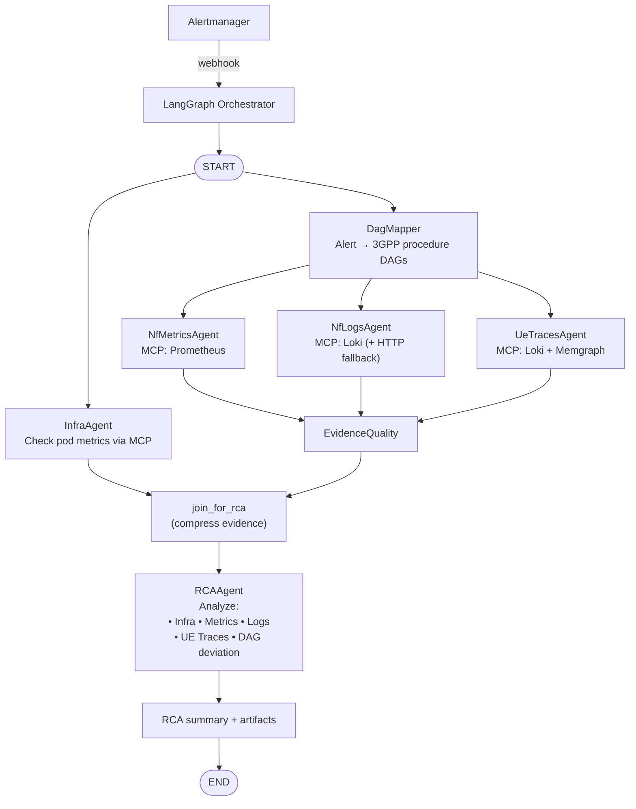
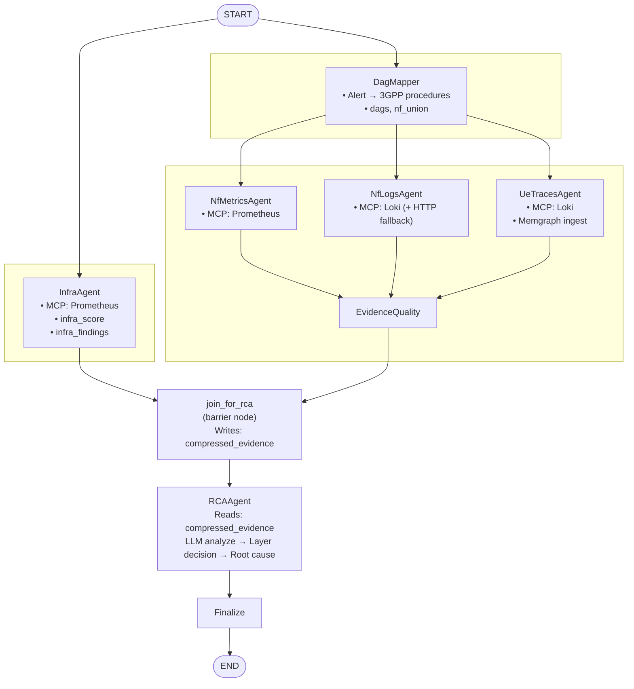

# PRODUCT REQUIREMENTS DOCUMENT
# 5G TriageAgent v3.2
## Multi-Agent LangGraph System for Real-Time Root Cause Analysis

| Version | Status | Date | Classification |
|---------|--------|------|----------------|
| **3.2** | Draft - For Review | February 2026 | Internal |

| | |
|---|---|
| **Owner** | Platform Engineering |
| **Reviewers** | Network Operations · SRE · 5G Architecture |

---

## Document Change Log
**Upgrade Date**: February 14, 2026 

## 1. Executive Summary

5G TriageAgent v3.2 is a multi-agent LangGraph orchestration system for real-time root cause analysis of 5G core network failures. When Prometheus Alertmanager fires an alert (e.g., `registration_failures > 0`), the system coordinates specialized agents through a directed graph workflow to localize failures across infrastructure, network function, and 3GPP procedure layers.

The architecture implements a multi-agent pipeline:
**InfraAgent** and **DagMapper** run in parallel from START. DagMapper fans out in parallel to **NfMetricsAgent**, **NfLogsAgent**, and **UeTracesAgent**, which converge at **EvidenceQuality**. Both **InfraAgent** and **EvidenceQuality** converge at **join_for_rca**, an explicit barrier node that compresses all evidence before **RCAAgent** runs.
Each agent has a focused responsibility and communicates through a shared state object. 3GPP procedure DAGs are pre-loaded into embedded Memgraph.

| 4 | MCP | Memgraph |
|---|-----|---------|
| Specialized agents | Data collection protocol | DAG knowledge base |

---

## 2. Architecture Overview

### 2.1 Multi-Agent LangGraph Workflow

Mermaid source

### 2.2 Agent Responsibilities

| Agent | Purpose | Inputs | Outputs | LLM? |
|-------|---------|--------|---------|------|
| **InfraAgent** | Infrastructure triage | Alert metadata, pod metrics | `infra_score`, `infra_findings` | No (rule-based) |
| **NfMetricsAgent** | NF Metrics collection | DAG NF list, time window | Prometheus metrics per NF | No (MCP query) |
| **NfLogsAgent** | NF Logs collection | DAG NF list, time window | Loki logs per NF | No (MCP query) |
| **UeTracesAgent** | IMSI traces construction | Loki NF logs, IMSI list, time window | IMSI traces, `trace_deviations` | No (MCP query) |
| **EvidenceQuality** | Evidence quality scoring | Metrics, logs, traces | `evidence_quality_score` | No (rule-based) |
| **join_for_rca** | Evidence-joining barrier | All evidence from `infra_agent` + `evidence_quality` | `compressed_evidence` | No (deterministic) |
| **RCAAgent** | Root cause analysis | `compressed_evidence` (infra + metrics + logs + traces + DAGs) | `root_nf`, `failure_mode`, `confidence`, `evidence_chain` | Yes (analysis) |

### 2.3 Shared State Object

All agents read/write to a LangGraph state object.

**Source**: `src/triage_agent/state.py`

Key state fields written by each stage:

| Field | Type | Written by | Read by |
|-------|------|-----------|---------|
| `infra_score` | `float` | `infra_agent` | `join_for_rca`, `rca_agent` |
| `infra_findings` | `dict \| None` | `infra_agent` | `join_for_rca` |
| `dags` | `list \| None` | `dag_mapper` | `metrics_agent`, `logs_agent`, `traces_agent`, `join_for_rca` |
| `nf_union` | `list \| None` | `dag_mapper` | `metrics_agent` |
| `metrics` | `dict \| None` | `metrics_agent` | `evidence_quality`, `join_for_rca` |
| `logs` | `dict \| None` | `logs_agent` | `evidence_quality`, `join_for_rca` |
| `trace_deviations` | `dict \| None` | `traces_agent` | `evidence_quality`, `join_for_rca` |
| `evidence_quality_score` | `float` | `evidence_quality` | `join_for_rca`, `rca_agent` |
| `compressed_evidence` | `dict[str, str] \| None` | `join_for_rca` | `rca_agent` |
| `root_nf`, `failure_mode`, `confidence`, `evidence_chain` | various | `rca_agent` | `finalize` |
| `final_report` | `dict \| None` | `finalize` | API response |

---

## 3. Agent Specifications

### 3.1 InfraAgent

**Trigger**: Always runs at START (parallel with DagMapper)
**LLM Calls**: 0 (rule-based)

**Source**: `src/triage_agent/agents/infra_agent.py`

#### 3.1.1 MCP Query to Prometheus

Query pod-level metrics for all potentially affected NFs:

| Metric | Query | Purpose |
|--------|-------|---------|
| Pod restarts | `pod_restarts` | Crash detection |
| OOM kills | `oom_kills_5m` | Memory pressure |
| CPU usage | `cpu_usage_rate_2m` | Resource saturation |
| Memory usage | `memory_usage_percent` | Memory saturation |
| Pod status | `pod_status` | Running/Pending/Failed |

See `infra_agent.py` → `INFRA_PROMETHEUS_QUERIES` for full PromQL.

> **Note (implementation status)**: The MCP Prometheus query in `infra_agent.py` is currently stubbed (`metrics: dict[str, Any] = {}  # TODO: wire up MCP client` at `infra_agent.py:283`). Until wired, `infra_score` is always `0.0` and `infra_findings` will be empty. The scoring model and output structure are fully implemented.

#### 3.1.2 Infrastructure Score Computation

4-factor weighted model:

| Factor | Weight | Scoring Logic | Relevant Query |
|--------|--------|---------------|----------------|
| Pod Reliability (Restarts) | 0.35 | 0 restarts: 0.0, 1-2: 0.4, 3-5: 0.7, >5: 1.0 | `pod_restarts` (1h count) |
| Critical Errors (OOM) | 0.25 | 0 OOMs: 0.0, >0: 1.0 (Critical Failure) | `oom_kills_5m` |
| Pod Health Status | 0.20 | Running: 0.0, Pending: 0.6, Failed/Unknown: 1.0 | `pod_status` |
| Resource Saturation | 0.20 | Mem >90%: 1.0, CPU >1.0 core: 0.8, Normal: 0.0 | `cpu_usage_rate`, `memory_usage_percent` |

#### 3.1.3 Output

Updates state with `infra_score`, `infra_findings`. Always forwards to RCAAgent (no early exit).

---

### 3.2 Memgraph DAG Storage

#### 3.2.1 Why Memgraph
1. In-memory-first graph DB with fast Cypher traversals, streaming ingestion support, and dynamic algorithms.
2. Compare captured IMSI trace against the normative one.
3. Cypher for deviation detection is fast: Pattern matching + shortest-path variants or subgraph isomorphism checks can pinpoint the first wrong step very efficiently (sub-100 ms on realistic alarm graphs of 20–150 nodes).
4. Minimal LLM surface area: Parsing logs → nodes/relationships is rule-based. The core deviation detection stays deterministic.

#### 3.2.2 Represent the 3GPP DAGs
Use Memgraph. One DAG per major procedure from TS 23.502.

#### 3.2.3 DAG Construction

- Option-1: auto-generate the base DAG from TS 23.502 sequence diagrams.
- Option-2: mine sequence from historical successful PCAPs or IMSI traces

**ADR-001**: Use Option-1.

Auto-generated reference DAGs in Memgraph:
1. Authentication_5G_AKA (sub-DAG from TS 33.501 Fig. 6.1.3.2-1) — `dags/authentication_5g_aka.cypher`
2. Registration_General (main DAG from TS 23.502 Fig. 4.2.2.2.2-1) — `dags/registration_general.cypher`
3. PDU Session Establishment (DAG from TS 23.502 Fig. 4.3.2.2.1-1) — `dags/pdu_session_establishment.cypher`

**Pattern Matching**:
- `*` matches any characters (wildcard)
- Patterns are **case-insensitive**
- Multiple patterns per phase increase detection coverage
- NfLogsAgent matches log messages against these patterns

---

### 3.3 NfMetricsAgent, NfLogsAgent & UeTracesAgent (Parallel Data Collection)

The three data collection agents all fan out in parallel from DagMapper and converge at EvidenceQuality. Each queries MCP servers for their respective data types using the `dags` and `nf_union` fields written by DagMapper.

#### 3.3.1 NfMetricsAgent

**Trigger**: `state["nf_union"]` populated by DagMapper
**LLM Calls**: 0 (pure MCP query)
**Source**: `src/triage_agent/agents/metrics_agent.py`

Pulls per-NF metrics (error rate, p95 latency, CPU, memory) from Prometheus for the candidate NF set provided by the DAG union.

#### 3.3.2 NfLogsAgent

**Trigger**: `state["dags"]` populated by DagMapper (runs in parallel with NfMetricsAgent and UeTracesAgent)
**LLM Calls**: 0 (two-path MCP + HTTP fallback)
**Source**: `src/triage_agent/agents/logs_agent.py`

Pulls ERROR/WARN/FATAL logs from Loki for the candidate NF set. Annotates log entries with matched DAG phase and failure pattern.

**Two-path architecture**:
1. Health-check MCP server availability (probe `/ready` endpoint).
2. If reachable → fetch all logs via `MCPClient`.
3. If unreachable → fetch all logs via direct Loki HTTP API fallback (via `httpx`).

#### 3.3.3 UeTracesAgent

**Trigger**: `state["dags"]` populated by DagMapper (runs in parallel with NfMetricsAgent and NfLogsAgent)
**LLM Calls**: 0 (two-path MCP + HTTP fallback, mirrors NfLogsAgent)
**Source**: `src/triage_agent/agents/ue_traces_agent.py`
**Trace Script**: `scripts/trace_ue_v3.sh`

Discovers all IMSIs active within the time window of the metric alarm. Pipeline:
1. IMSI discovery pass (Loki query)
2. Per-IMSI trace construction
3. Memgraph ingestion + deviation detection against reference DAG

Outputs `discovered_imsis`, `traces_ready`, and `trace_deviations` (`dict[str, list[dict]]` keyed by dag_name) to state.

#### 3.3.4 Evidence Quality Scoring

**Source**: `src/triage_agent/agents/evidence_quality.py`

After the three collection agents complete, computes evidence quality based on data diversity:

| Available Evidence | Quality Score |
|---|---|
| Metrics + logs + traces | 0.95 |
| Traces + one other source | 0.85 |
| Metrics + logs (no traces) | 0.80 |
| Traces only | 0.50 |
| Metrics only | 0.40 |
| Logs only | 0.35 |
| No evidence | 0.10 |

#### 3.3.5 join_for_rca (Evidence-Joining Barrier)

**Source**: `src/triage_agent/agents/rca_agent.py`

Evidence-joining barrier node in `rca_agent.py`. Waits for both `infra_agent` and `evidence_quality` to complete before compressing all evidence for the LLM context window. Writes to `compressed_evidence` state field.

LangGraph guarantees that all edges pointing into `join_for_rca` (`infra_agent → join_for_rca` and `evidence_quality → join_for_rca`) must complete before `join_for_rca` executes. This replaces the previous implicit assumption that infra data would be present due to superstep-merge timing.

---

### 3.4 RCAAgent

**Trigger**: `join_for_rca` barrier node completes (guarantees both `infra_agent` and `evidence_quality` have written to state before execution)
**LLM Calls**: 1 (single attempt; `max_attempts=1`)
**Source**: `src/triage_agent/agents/rca_agent.py`

**Rationale**: RCAAgent has full context (infrastructure + application evidence) to make informed decision. For example:
- **Pure infrastructure**: OOMKill + no application errors → infrastructure layer
- **Infrastructure-triggered app failure**: OOMKill + cascading application errors → infrastructure root cause, but application symptoms visible
- **Pure application**: No infrastructure issues + application errors → application layer

#### 3.4.1 First Attempt Analysis

**Input**:
- `state["compressed_evidence"]` → pre-compressed evidence dict written by `join_for_rca`, containing formatted sections for the LLM prompt (infra findings, DAGs, metrics, logs, trace deviations)
- `state["evidence_quality_score"]` → data completeness
- `state["infra_score"]` → infrastructure layer score (used for threshold decisions)

The LLM prompt template is defined in `rca_agent.py` → `RCA_PROMPT_TEMPLATE`. It provides the LLM with infrastructure findings, procedure DAG, application evidence (metrics, logs, trace deviations), and a structured analysis framework.

The LLM returns a JSON object with: `layer`, `root_nf`, `failure_mode`, `failed_phase`, `confidence`, `evidence_chain`, `alternative_hypotheses`, and `reasoning`.

#### 3.4.2 Confidence Gate & LLM Configuration

Minimum confidence threshold: `0.70` (lowered to `0.65` when `evidence_quality_score ≥ 0.80`). With `max_attempts=1` there is no retry — the single attempt always proceeds to `finalize`.

**LLM client parameters** (all providers):
- `max_tokens=4096` — caps output length; prevents unbounded Qwen3 thinking-mode generation
- `streaming=True` — uses SSE streaming so the inference server cancels generation immediately on client disconnect
- `timeout=300` — HTTP client timeout (seconds)
- `temperature=0.1` — near-zero for deterministic JSON output

---

## 4. LangGraph Implementation

### 4.1 State Diagram

Mermaid source

### 4.2 LangGraph Definition

**Entry point**: `create_workflow()` in `src/triage_agent/graph.py`. State is initialized via `get_initial_state(alert, incident_id)`.

**Nodes**:

| Node | Function |
|------|----------|
| `infra_agent` | `infra_agent` (from `agents/infra_agent.py`) |
| `dag_mapper` | `dag_mapper` (from `agents/dag_mapper.py`) |
| `metrics_agent` | `metrics_agent` (from `agents/metrics_agent.py`) |
| `logs_agent` | `logs_agent` (from `agents/logs_agent.py`) |
| `traces_agent` | `ue_traces_agent` (from `agents/ue_traces_agent.py`) |
| `evidence_quality` | `compute_evidence_quality` (from `agents/evidence_quality.py`) |
| `join_for_rca` | `join_for_rca` (from `agents/rca_agent.py`) |
| `rca_agent` | `rca_agent_first_attempt` (from `agents/rca_agent.py`) |
| `increment_attempt` | `increment_attempt` (inline, increments `attempt_count`) |
| `finalize` | `finalize_report` (inline, assembles `final_report`) |

**Edges**:

- `START → infra_agent` (parallel with dag_mapper)
- `START → dag_mapper` (parallel with infra_agent)
- Parallel fan-out from dag_mapper: `dag_mapper → metrics_agent`, `dag_mapper → logs_agent`, `dag_mapper → traces_agent`
- Parallel converge at evidence: `metrics_agent → evidence_quality`, `logs_agent → evidence_quality`, `traces_agent → evidence_quality`
- Explicit barrier converge: `infra_agent → join_for_rca`, `evidence_quality → join_for_rca` (LangGraph waits for all incoming edges before executing `join_for_rca`)
- `join_for_rca → rca_agent`
- Conditional routing: `rca_agent → increment_attempt` (retry) or `rca_agent → finalize` (done) via `should_retry()`
- `increment_attempt → rca_agent`
- `finalize → END`

### 4.3 LangSmith Tracing Configuration
LangSmith provides distributed tracing for observability across the multi-agent workflow.

Each agent is wrapped with `@traceable` decorator for automatic span creation. LLM calls are also traced by LangSmith.

**Key Metrics Tracked**:
- **Latency**: Per-agent execution time
- **LLM Tokens**: Input/output tokens per call
- **MCP Success Rate**: % of successful MCP queries
- **Confidence Distribution**: Histogram of final confidence scores
- **Layer Attribution**: Infrastructure vs Application ratio

---

## 5. Memgraph DAG Storage

### 5.1 Memgraph Configuration

**Deployment**: Memgraph runs as sidecar container in triage-agent pod

**Persistence**: Memgraph periodic snapshots every 60s, WAL (write-ahead logging) enabled

**Memory**: 256MB allocated (sufficient for ~50 DAG definitions)

### 5.2 DAG Pre-loading Strategy
**Approach**: Use init container to preload DAGs before main application starts.

**DAG Source Files**: `dags/*.cypher`

**Init Container Configuration**: `k8s/deployment-with-init.yaml`

---

## 6. Observability & Monitoring

### 6.1 LangSmith Dashboard Setup

**Project Configuration**: `5g-triage-agent-v3`, environment `production`

### 6.2 Key Performance Indicators (KPIs)

| Metric | Target | Alert Threshold | LangSmith Query |
|--------|--------|-----------------|-----------------|
| P95 Latency | <5.5s | >8s | `run_type="chain" AND name="TriageWorkflow"` |
| LLM Token Usage (avg) | <4000 tokens/investigation | >6000 | `run_type="llm" AND status="success"` |
| MCP Success Rate | >95% | <90% | `run_type="tool" AND name LIKE "MCP-%"` |
| Confidence Score (avg) | >0.80 | <0.65 | `outputs.confidence` |
| Infrastructure Attribution | 20-30% | - | `outputs.layer="infrastructure"` |
| Application Attribution | 70-80% | - | `outputs.layer="application"` |

### 6.3 Alerting Rules

> **Note (implementation status)**: `src/triage_agent/observability/alerting.py` is planned but not yet implemented.

### 6.4 Custom Dashboards

**Investigation Overview Dashboard**: Total investigations, success rate (confidence >0.70), layer distribution, average latency trend, LLM token consumption.

**Agent Performance Dashboard**: InfraAgent avg latency and infra_score distribution, NfMetricsAgent/NfLogsAgent MCP success rates, RCAAgent confidence distribution.

**MCP Health Dashboard**: Prometheus/Loki/k8s API success rates, average query latency per MCP server.

### 6.5 Feedback Loop Integration

> **Note (implementation status)**: `src/triage_agent/observability/feedback.py` is planned but not yet implemented.

Operators will be able to submit feedback (correct/incorrect/partial) per investigation. Feedback will be stored in LangSmith and used for confidence calibration.

---

## 7. MCP Integration

### 7.1 MCP Servers

| Server | Purpose | Endpoint | Timeout | Status |
|--------|---------|----------|---------|--------|
| Prometheus | Metrics queries | `http://kube-prom-kube-prometheus-prometheus.monitoring:9090` | 3s | Implemented |
| Loki | Log queries | `http://loki.monitoring:3100` | 3s | Implemented |
| Kubernetes API | Pod/node status | `https://kubernetes.default.svc` | 500ms | Planned (not yet in `mcp/client.py`) |

### 7.2 MCP Client Configuration

**Source**: `src/triage_agent/mcp/client.py`

---

## 8. Deployment Architecture

### 8.1 Container Structure

**Source**: `k8s/deployment.yaml` (simple), `k8s/deployment-with-init.yaml` (with DAG pre-loading)

### 8.2 Alertmanager Webhook Configuration

**Source**: `k8s/alertmanager-webhook.yaml`

---

*— End of Document —*
