# PRODUCT REQUIREMENTS DOCUMENT
# 5G TriageAgent v3.2
## Multi-Agent LangGraph System for Real-Time Root Cause Analysis

| Version | Status | Date | Classification |
|---------|--------|------|----------------|
| **3.2** | Draft - For Review | February 2026 | Internal |

| | |
|---|---|
| **Owner** | Platform Engineering |
| **Reviewers** | Network Operations · SRE · 5G Architecture |

---

## Document Change Log
**Upgrade Date**: February 14, 2026 

## 1. Executive Summary

5G TriageAgent v3.2 is a multi-agent LangGraph orchestration system for real-time root cause analysis of 5G core network failures. When Prometheus Alertmanager fires an alert (e.g., `registration_failures > 0`), the system coordinates specialized agents through a directed graph workflow to localize failures across infrastructure, network function, and 3GPP procedure layers.

The architecture implements a multi-agent pipeline:
**InfraAgent** (parallel) → **NfMetricsAgent/NfLogsAgent/UeTracesAgent** (parallel) → **RCAAgent**
, where each agent has a focused responsibility and communicates through a shared state object. 3GPP procedure DAGs are pre-loaded into embedded Memgraph.

| 4 | MCP | Memgraph |
|---|-----|---------|
| Specialized agents | Data collection protocol | DAG knowledge base |

---

## 2. Architecture Overview

### 2.1 Multi-Agent LangGraph Workflow

```mermaid
flowchart TD
    A["Alertmanager"] -->|webhook| B["LangGraph Orchestrator"]
    B --> C(["START"])

    C --> D["InfraAgent<br/>Check pod metrics via MCP"]
    C --> E["NfMetricsAgent +<br/>NfLogsAgent +<br/>UeTracesAgent<br/>(parallel)<br/>MCP: Prometheus, Loki"]

    E --> F["EvidenceQuality"]

    D --> G
    F --> G

    G["RCAAgent<br/>Analyze:<br/>• Infra • Metrics • Logs<br/>• UE Traces • DAG Cypher deviation"]

    G --> H["RCA summary + artifacts"]
    H --> I(["END"])
```

Mermaid source

### 2.2 Agent Responsibilities

| Agent | Purpose | Inputs | Outputs | LLM? |
|-------|---------|--------|---------|------|
| **InfraAgent** | Infrastructure triage | Alert metadata, pod metrics | `infra_score`, `infra_findings` | No (rule-based) |
| **NfMetricsAgent** | NF Metrics collection | DAG NF list, time window | Prometheus metrics per NF | No (MCP query) |
| **NfLogsAgent** | NF Logs collection | DAG NF list, time window | Loki logs per NF | No (MCP query) |
| **UeTracesAgent** | IMSI traces construction | Loki NF logs, IMSI list, time window | IMSI traces, `trace_deviations` | No (MCP query) |
| **RCAAgent** | Root cause analysis | DAG + metrics + logs + UE traces + infra | `root_nf`, `failure_mode`, `confidence`, `evidence_chain` | Yes (analysis, with degraded mode fallback) |

### 2.3 Shared State Object

All agents read/write to a LangGraph state object.

**Source**: `src/triage_agent/state.py`

---

## 3. Agent Specifications

### 3.1 InfraAgent

**Trigger**: Always runs at START (parallel with data collection agents)
**LLM Calls**: 0 (rule-based)

**Source**: `src/triage_agent/agents/infra_agent.py`

#### 3.1.1 MCP Query to Prometheus

Query pod-level metrics for all potentially affected NFs:

| Metric | Query | Purpose |
|--------|-------|---------|
| Pod restarts | `pod_restarts` | Crash detection |
| OOM kills | `oom_kills_5m` | Memory pressure |
| CPU usage | `cpu_usage_rate_2m` | Resource saturation |
| Memory usage | `memory_usage_percent` | Memory saturation |
| Pod status | `pod_status` | Running/Pending/Failed |

See `infra_agent.py` → `INFRA_PROMETHEUS_QUERIES` for full PromQL.

#### 3.1.2 Infrastructure Score Computation

4-factor weighted model:

| Factor | Weight | Scoring Logic | Relevant Query |
|--------|--------|---------------|----------------|
| Pod Reliability (Restarts) | 0.35 | 0 restarts: 0.0, 1-2: 0.4, 3-5: 0.7, >5: 1.0 | `pod_restarts` (1h count) |
| Critical Errors (OOM) | 0.25 | 0 OOMs: 0.0, >0: 1.0 (Critical Failure) | `oom_kills_5m` |
| Pod Health Status | 0.20 | Running: 0.0, Pending: 0.6, Failed/Unknown: 1.0 | `pod_status` |
| Resource Saturation | 0.20 | Mem >90%: 1.0, CPU >1.0 core: 0.8, Normal: 0.0 | `cpu_usage_rate`, `memory_usage_percent` |

#### 3.1.3 Output

Updates state with `infra_score`, `infra_findings`. Always forwards to RCAAgent (no early exit).

---

### 3.2 Memgraph DAG Storage

#### 3.2.1 Why Memgraph
1. In-memory-first graph DB with fast Cypher traversals, streaming ingestion support, and dynamic algorithms.
2. Compare captured IMSI trace against the normative one.
3. Cypher for deviation detection is fast: Pattern matching + shortest-path variants or subgraph isomorphism checks can pinpoint the first wrong step very efficiently (sub-100 ms on realistic alarm graphs of 20–150 nodes).
4. Minimal LLM surface area: Parsing logs → nodes/relationships is rule-based. The core deviation detection stays deterministic.

#### 3.2.2 Represent the 3GPP DAGs
Use Memgraph. One DAG per major procedure from TS 23.502.

#### 3.2.3 DAG Construction

- Option-1: auto-generate the base DAG from TS 23.502 sequence diagrams.
- Option-2: mine sequence from historical successful PCAPs or IMSI traces

**ADR-001**: Use Option-1.

Auto-generated reference DAGs in Memgraph:
1. Authentication_5G_AKA (sub-DAG from TS 33.501 Fig. 6.1.3.2-1) — `dags/authentication_5g_aka.cypher`
2. Registration_General (main DAG from TS 23.502 Fig. 4.2.2.2.2-1) — `dags/registration_general.cypher`
3. PDU Session Establishment (DAG from TS 23.502 Fig. 4.3.2.2.1-1) — `dags/pdu_session_establishment.cypher`

**Pattern Matching**:
- `*` matches any characters (wildcard)
- Patterns are **case-insensitive**
- Multiple patterns per phase increase detection coverage
- NfLogsAgent matches log messages against these patterns

---

### 3.3 NfMetricsAgent & NfLogsAgent & UeTracesAgent (Parallel Execution)

All three agents execute in parallel to minimize latency. Each queries MCP servers for their respective data types.

#### 3.3.1 NfMetricsAgent

**Trigger**: `state["dag"]` is populated
**LLM Calls**: 0 (pure MCP query)
**Source**: `src/triage_agent/agents/metrics_agent.py`

Pulls per-NF metrics (error rate, p95 latency, CPU, memory) from Prometheus for the candidate NF set provided by the DAG.

#### 3.3.2 NfLogsAgent

**Trigger**: `state["dag"]` is populated
**LLM Calls**: 0 (pure MCP query)
**Source**: `src/triage_agent/agents/logs_agent.py`

Pulls ERROR/WARN/FATAL logs from Loki for the candidate NF set. Annotates log entries with matched DAG phase and failure pattern.

#### 3.3.3 UeTracesAgent

**Trigger**: `state["dag"]` is populated
**LLM Calls**: 0 (pure MCP query)
**Source**: `src/triage_agent/agents/ue_traces_agent.py`
**Trace Script**: `scripts/trace_ue_v3.sh`

Discovers all IMSIs active within the time window of the metric alarm. Pipeline:
1. IMSI discovery pass (Loki query)
2. Per-IMSI trace construction
3. Memgraph ingestion + deviation detection against reference DAG

Outputs `discovered_imsis`, `traces_ready`, and `trace_deviations` to state.

#### 3.3.4 Evidence Quality Scoring

**Source**: `src/triage_agent/agents/evidence_quality.py`

After agents complete, computes evidence quality based on data diversity:

| Available Evidence | Quality Score |
|---|---|
| Metrics + logs + traces | 0.95 |
| Traces + one other source | 0.85 |
| Metrics + logs (no traces) | 0.80 |
| Traces only | 0.50 |
| Metrics only | 0.40 |
| Logs only | 0.35 |
| No evidence | 0.10 |

---

### 3.4 RCAAgent

**Trigger**: NfMetricsAgent, NfLogsAgent, and UeTracesAgent complete
**LLM Calls**: 1 per attempt (max 2 total)
**Source**: `src/triage_agent/agents/rca_agent.py`

**Rationale**: RCAAgent has full context (infrastructure + application evidence) to make informed decision. For example:
- **Pure infrastructure**: OOMKill + no application errors → infrastructure layer
- **Infrastructure-triggered app failure**: OOMKill + cascading application errors → infrastructure root cause, but application symptoms visible
- **Pure application**: No infrastructure issues + application errors → application layer

#### 3.4.1 First Attempt Analysis

**Input**:
- `state["dag"]` → 3GPP procedure structure
- `state["metrics"]` → per-NF metrics
- `state["logs"]` → per-NF logs
- `state["trace_deviations"]` → per-IMSI DAG deviation results from Memgraph
- `state["evidence_quality_score"]` → data completeness

The LLM prompt template is defined in `rca_agent.py` → `RCA_PROMPT_TEMPLATE`. It provides the LLM with infrastructure findings, procedure DAG, application evidence (metrics, logs, trace deviations), and a structured analysis framework.

The LLM returns a JSON object with: `layer`, `root_nf`, `failure_mode`, `failed_phase`, `confidence`, `evidence_chain`, `alternative_hypotheses`, and `reasoning`.

#### 3.4.2 Confidence Decision

Minimum confidence threshold: 0.70 (lowered to 0.65 if evidence quality ≥ 0.80). If confidence is below threshold, a second attempt is triggered with additional evidence collection.

---

## 4. LangGraph Implementation

### 4.1 State Diagram

```mermaid
flowchart TD
    START(["START"]) --> INFRA & DATA

    subgraph left [" "]
        INFRA["InfraAgent<br/>• MCP: k8s + Prometheus<br/>• infra_score<br/>• infra_findings"]
    end

    subgraph right [" "]
        DATA["Data Collection (parallel)"]
        DATA --> M["NfMetricsAgent<br/>• MCP: Prometheus"]
        DATA --> L["NfLogsAgent<br/>• MCP: Loki"]
        DATA --> U["UeTracesAgent<br/>• MCP: Loki<br/>• Memgraph ingest"]
        M & L & U --> EQ["EvidenceQuality"]
    end

    INFRA --> RCA
    EQ --> RCA

    RCA["RCAAgent<br/>Inputs: infra_findings, metrics,<br/>logs, UE traces, DAG from Memgraph<br/>LLM analyze → Layer decision → Root cause"]

    RCA --> FIN["Finalize"]
    FIN --> END_NODE(["END"])
```

Mermaid source

### 4.2 LangGraph Definition
TODO: implement during coding phase

### 4.3 LangSmith Tracing Configuration
LangSmith provides distributed tracing for observability across the multi-agent workflow.

Each agent is wrapped with `@traceable` decorator for automatic span creation. LLM calls are also traced by LangSmith.

**Key Metrics Tracked**:
- **Latency**: Per-agent execution time
- **LLM Tokens**: Input/output tokens per call
- **MCP Success Rate**: % of successful MCP queries
- **Confidence Distribution**: Histogram of final confidence scores
- **Layer Attribution**: Infrastructure vs Application ratio
- **Second Attempt Rate**: % of investigations requiring additional evidence

---

## 5. Memgraph DAG Storage

### 5.1 Memgraph Configuration

**Deployment**: Memgraph runs as sidecar container in triage-agent pod

**Persistence**: Memgraph periodic snapshots every 60s, WAL (write-ahead logging) enabled

**Memory**: 256MB allocated (sufficient for ~50 DAG definitions)

### 5.2 DAG Pre-loading Strategy
**Approach**: Use init container to preload DAGs before main application starts.

**DAG Source Files**: `dags/*.cypher`

**Init Container Configuration**: `k8s/deployment-with-init.yaml`

---

## 6. Observability & Monitoring

### 6.1 LangSmith Dashboard Setup

**Project Configuration**: `5g-triage-agent-v3`, environment `production`

### 6.2 Key Performance Indicators (KPIs)

| Metric | Target | Alert Threshold | LangSmith Query |
|--------|--------|-----------------|-----------------|
| P95 Latency | <5.5s | >8s | `run_type="chain" AND name="TriageWorkflow"` |
| LLM Token Usage (avg) | <4000 tokens/investigation | >6000 | `run_type="llm" AND status="success"` |
| MCP Success Rate | >95% | <90% | `run_type="tool" AND name LIKE "MCP-%"` |
| Confidence Score (avg) | >0.80 | <0.65 | `outputs.confidence` |
| Second Attempt Rate | <15% | >30% | `outputs.needs_more_evidence=true` |
| Infrastructure Attribution | 20-30% | - | `outputs.layer="infrastructure"` |
| Application Attribution | 70-80% | - | `outputs.layer="application"` |

### 6.3 Alerting Rules

**Source**: `src/triage_agent/observability/alerting.py`

### 6.4 Custom Dashboards

**Investigation Overview Dashboard**: Total investigations, success rate (confidence >0.70), layer distribution, average latency trend, LLM token consumption.

**Agent Performance Dashboard**: InfraAgent avg latency and infra_score distribution, NfMetricsAgent/NfLogsAgent MCP success rates, RCAAgent confidence distribution and second attempt rate.

**MCP Health Dashboard**: Prometheus/Loki/k8s API success rates, average query latency per MCP server.

### 6.5 Feedback Loop Integration

**Source**: `src/triage_agent/observability/feedback.py`

Operators can submit feedback (correct/incorrect/partial) per investigation. Feedback is stored in LangSmith and used for confidence calibration.

---

## 7. MCP Integration

### 7.1 MCP Servers

| Server | Purpose | Endpoint | Timeout |
|--------|---------|----------|---------|
| Prometheus | Metrics queries | `http://prometheus:9090` | 3s |
| Loki | Log queries | `http://loki:3100` | 3s |
| Kubernetes API | Pod/node status | `https://kubernetes.default.svc` | 500ms |

### 7.2 MCP Client Configuration

**Source**: `src/triage_agent/mcp/client.py`

---

## 8. Deployment Architecture

### 8.1 Container Structure

**Source**: `k8s/deployment.yaml` (simple), `k8s/deployment-with-init.yaml` (with DAG pre-loading)

### 8.2 Alertmanager Webhook Configuration

**Source**: `k8s/alertmanager-webhook.yaml`

---

*— End of Document —*
